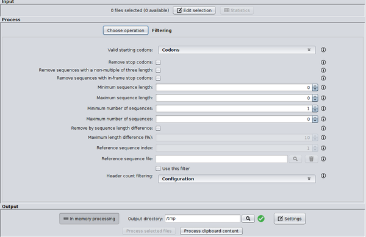

# SEDA  
SEDA (*SEquence DAtaset builder*) is an open source application for processing FASTA files containing DNA and protein sequences. Please, visit the [official web page](http://www.sing-group.org/seda) of the project for downloads, a [complete online manual](http://www.sing-group.org/seda/manual) and support.

## Features
Among other functions, SEDA allows you to:
- Filter sequences based on different criteria (including text patterns).
- Translate nucleic acid sequences into amino acid sequences.
- Edit sequence headers in different ways.
- Remove duplicated sequences.
- Remove isoforms.
- Sort, merge, split or reformat FASTA files.
- Use [BLAST](https://blast.ncbi.nlm.nih.gov/Blast.cgi?CMD=Web&PAGE_TYPE=BlastDocs&DOC_TYPE=Download) to perform different types of queries.
- Use [Clustal Omega ](http://www.clustal.org/omega/) to perform multiple sequence alignments.

## For programmers
Programmers can take advantage of the SEDA core to develop new operations to process FASTA files. In addition, SEDA has a plugin-based architecture, so new functions can be added to SEDA through plugins.