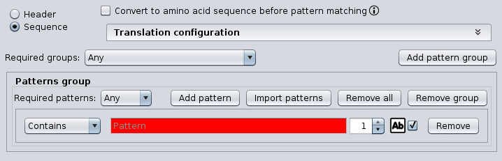

Advanced usage
**************

.. _advanced-pattern-configuration:

Pattern configuration
=====================

The following configuration panel is common to some operations and allows to define complex patterns by creating groups of regular expressions.

For each pattern group, at least one pattern is required. The string pattern can be a regular expression. If more than one pattern is introduced (by clicking the *‘Add pattern‘* button), the *‘Required patterns‘* option allows specifying how patterns must be combined: *‘All’* means that all patterns must be present and *’Any’* means that only one pattern must be present to consider that the pattern is present. Moreover, the combobox at the left of the pattern field allows to specify whether the pattern must be present (*‘Contains’*) or not (*‘Not contains’*), the text field at the left allows to define the minimum number of occurrences of the specified pattern and the ‘Ab’ icon allows to specify whether the regular expression must be applied as case sensitive or not. Note that patterns are evaluated as regular expressions, providing even more flexibility. Refer to section :ref:`Regular expressions<advanced-regex>` to learn more about this.

If more than one pattern group is introduced (by clicking the *‘Add pattern group’* button), the *‘Required groups‘* option allows specifying how groups must be combined: *‘All’* means that all groups must be present and *’Any’* means that only one group must be present to consider that the pattern is present.

In addition, the *‘Import patterns’* button shows different options allowing to import a set of patterns from:

- Plain-text file: each line is added as a pattern to the selected pattern group.
- FASTA file (sequence IDs): each sequence identifier found in the FASTA file is added as a pattern to the selected pattern group.
- FASTA file (headers): each sequence header found in the FASTA file is added as a pattern to the selected pattern group.
- FASTA file (sequences): each sequence found in the FASTA file is added as a pattern to the selected pattern group.

For instance, imagine that you have the following four patterns:

- P1: AAAGCCC
- P2: AAATCCC
- P3: CCCGAAA
- P4: CCCTAAAA

If you want to filter sequences so that you are only interested in those containing both P1 and P2 but not containing both P3 and P4, you must define two pattern groups as follows:

- Required groups: *‘All’*
- Pattern group 1:

  - Required patterns: *‘All’*
  - Contains P1 (minimum occurrences: = 1)
  - Contains P2 (minimum occurrences: = 1)

- Pattern group 2:

  - Required patterns: *‘All’*
  - Not contains P3 (minimum occurrences: = 1)
  - Not contains P3 (minimum occurrences: = 1)

.. _advanced-regex:

Regular expressions
===================

Some operations allow the use of regular expressions to define patterns or substitutions. Here are some helpful links to learn more about regular expressions:

- Regular expressions in Java: https://docs.oracle.com/javase/tutorial/essential/regex/
- Online tools for testing regular expressions:

  - http://myregexp.com/
  - http://java-regex-tester.appspot.com/

Special characters
------------------

The following characters are special characters or metacharacters: <([{\^-=$!|]})?*+.>. This means that they have a special meaning as regular expressions. For instance, the ‘.’ character means any character. If you want to use them in regular expressions as literals but not as special characters, then you should precede them by a ‘\\’.

Quantifiers
-----------

A very useful aspect of regular expressions is the use of quantifiers. They allow to specify the number of occurrences to match against. The following table shows a list of the most common quantifiers that may be useful to filter sequences.

==================  =======================================
Regular expression  Meaning
==================  =======================================
X?                  X, once or not at all
X*                  X, zero or more times
X+                  X, one or more times
X{n}                X, exactly n times
X{n,}               X, at least n times
X{n,m}              X, at least n but not more than m times
==================  =======================================

For instance, imagine that you have two sequences: S1 whose content is AAAACTTTT and S2 whose content is AAAACCTTTT. If you want to obtain only those sequences containing at least two C bases, you must use the regular expression *C{2,}*.

Boundary matchers
-----------------

Boundary matchers are helpful to specify where a regular expression should be located. The most useful boundary matchers are:

- ^: the beginning of a line.
- $: the end of a line.

For instance, imagine that you want to use the Pattern filtering operation to keep only sequences having the specified pattern (e.g. AAACCCTTT) only at the end. In this case, you should use the pattern *AAACCCTTT$*.

