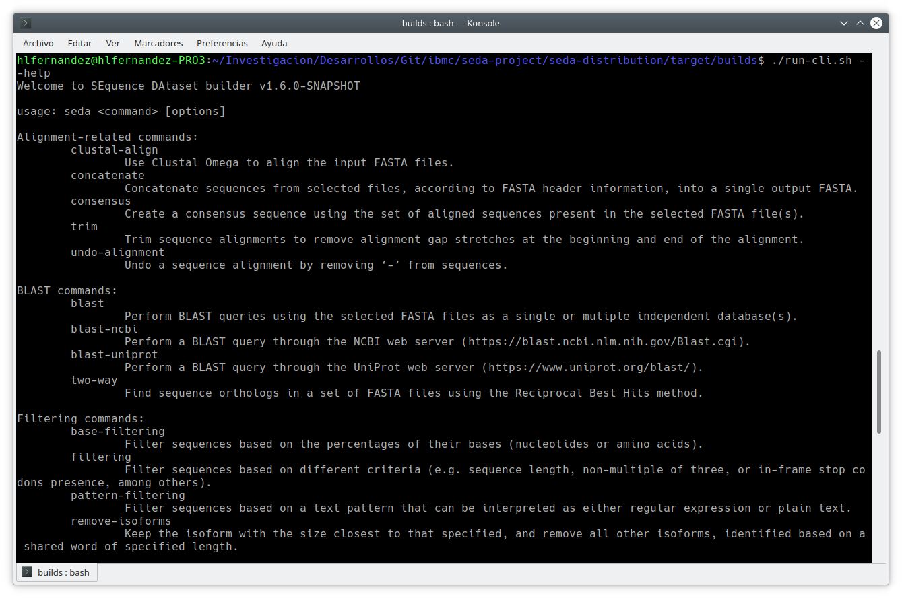

Command-line interface
**********************

The SEDA Command-Line Interface (CLI) can be executed using the ``run-cli.sh``, ``run-cli.bat``, or ``run-cli.command`` scripts included in the corresponding SEDA distributions for Linux, Windows and Mac OS X. It can be also run using the official Docker image available at Docker Hub (https://hub.docker.com/r/pegi3s/seda/).

As the image below shows, the ``run-cli.sh --help`` command displays the list of SEDA commands, grouped by type.

The help of specific commands can be obtained with ``run-cli.sh help <command_name>``. Such help shows the command-specific and general parameters, grouped in:

- *Command options*: command-specific parameters, which are different for each SEDA command (i.e. for each operation).
- General options, which are the same for all commands. These include: *Input options*, *Output options*, *Configuration options* and *Command configuration files*.
- *External dependencies options*: command-specific parameters, which appear for those SEDA commands requiring external software (e.g. BLAST, bedtools, etc.).

Input options
=============

The SEDA CLI allows specifying the input files using three alternative command-line parameters:

- ``--input-directory/-id <input-directory>``: specifies the path to the folder containing the files to process.
- ``--input-file/-if <input-file>``: specifies the path to the file to process and can be specified multiple times.
- ``--input-list/-il <input-list>``: specifies the path to a plain-text file with the paths of the files to process.

Output options
==============

The main output option is ``--output-directory/-od <output-directory>``, which specifies the folder path to the folder to create the result files. Then, two additional parameters can be specified:

- ``--output-group-size/-sz <output-group-size>``: whether output files must be split into subdirectories of a defined size. By default (0), no split subdirectories are created.
- ``--output-gzip/-gz``: whether the output files must be compressed using gzip.

Command configuration files
===========================

The ``--save-parameters-file/-spf <save-parameters-file>`` allows specifying a file to save the command configuration options for later reuse. The ``--parameters-file/-pf <parameters-file>`` allows setting the command configuration from such configuration files, created using the CLI or the GUI.

Configuration options
=====================

The ``--in-disk-processing/-dp`` flag indicates whether files must be procesed in hard disk. If not specified, files are processed in RAM memory. This option is slower but allows processing big batches of files with thousands of sequences.
