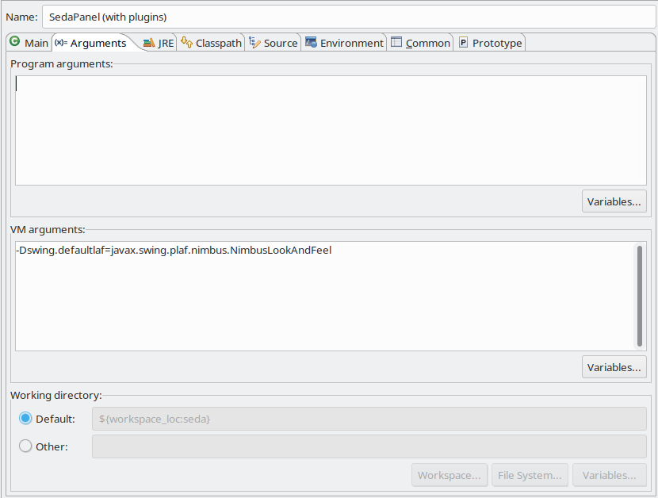
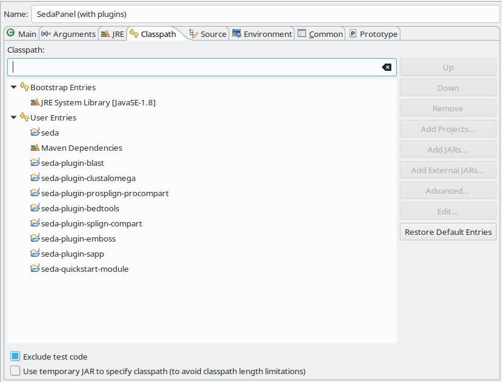

Developers
**********

This section provides an overview on the most important topics for developers of SEDA operations.

.. _basics:

Basic concepts
==============

The processing of sequences in SEDA is built around the idea of *’transformations’*. A transformation receives a sequence, a group of sequences (e.g. a FASTA file) or a dataset (a set of FASTA files) and returns a transformed item of the same type (i.e. a sequence if it receives a sequence as input).

The interface ``Sequence`` represents a single DNA or protein sequence and objects of this class can be transformed using a ``SequenceTransformation``.

The interface ``SequencesGroup`` represents a group of ``Sequence`` objects and objects of this class can be transformed using a ``SequencesGroupTransformation``. Objects of this class also store a map of properties which is used to keep information regarding the entire set of sequences (e.g. SEDA uses it to store the line break type when reading them from FASTA files).

The interface ``SequencesGroupDataset`` represents a set of ``SequencesGroup`` objects of this class can be transformed using a ``SequencesGroupDatasetTransformation``.

Each of the three operation interfaces has *’concat*’ methods to concatenate operations of their corresponding types. In addition, two implementations are provided:

- An implementation of ``SequencesGroupTransformation`` called ``ComposedSequencesGroupTransformation``, which allows applying several ``SequenceTransformation`` to all the sequences in a sequences group.
- An implementation of ``SequencesGroupDatasetTransformation`` called ``ComposedSequencesGroupDatasetTransformation``, which allows applying several ``SequencesGroupTransformation`` to all the sequence groups in a dataset.

These two transformation are useful to create SEDA operations as the :ref:`Operations and plugins<plugins>` section explains.

The ``DatatypeFactory`` (Abstract Factory pattern)
--------------------------------------------------

All transformations implemented in SEDA receive in their constructors an object that implements the ``DatatypeFactory`` interface. This interface defines several methods to build ``Sequence``, ``SequenceGroup`` and ``SequencesGroupDataset`` objects.

SEDA has two implementations of this interface and uses one of them when requesting the ``SequencesGroupDatasetTransformation`` objects to the corresponding ``TransformationProvider`` objects (see the :ref:`Operations and plugins<plugins>` section for more details about this).

By one hand, the ``InDiskDatatypeFactory`` processes sequences from files instead of having their contents in memory. If a ``SequencesGroup`` is created from a FASTA file, then this factory creates an object of class ``InDiskSequencesGroup`` that stores objects of class ``InDiskSequence`` that retrieve the sequence contents from the original file every time they are requested using a ``RandomAccessFile``. Also, if a ``InDiskSequence`` is created by passing the header and nucleotide or amino acid chain to its constructor (or using the ``InDiskSequence::newSequence`` method), this class stores the sequence into a temporary file and does the same. This class is aimed to allow processing big datasets in computers with a low amount of RAM memory available.

On the other hand, the ``InMemoryDatatypeFactory`` uses implementations like ``InMemorySequencesGroup`` and ``InMemorySequence`` that keep the sequence contents in memory.

It is important to note that both factories can be created using a ``charsetSupportEnabled`` parameter. When the no-args constructor is used, this is set to false, which means that SEDA will use a fast loading algorithm that works with most of the FASTA files without special characters. When set to true, SEDA will try to automatically identify the charset used by each FASTA file before loading them, resulting in a slower processing. This option should be used only if the input FASTA file contain special characters or SEDA have failed to load them.

Writing and reading FASTA files
--------------------------------------------------

The ``FastaWriter`` class provides different methods to write collections of ``Sequence`` objects into files using the FASTA format. These methods allows specifying the charset, the line break character, and whether the output must be compressed in gzip or not.

In the other hand, the ``FastaReader`` class provides different methods to parse FASTA files and retrieve an stream of ``Sequence`` objects. There are two versions of the ``readFasta`` method, one receiving a ``SequenceFromTextBuilder`` object and another one receiving an ``SequenceFromLocationsBuilder`` object. The former, which is used by the ``InMemorySequencesGroup`` class, parses the file loading their contents in memory and invokes the ``create`` method of the ``SequenceFromTextBuilder`` object each time a complete sequence has been parsed. The latter, which is used by the ``ÌnDiskSequencesGroup`` class, parses the file indexing the positions of each sequence in the input file and invokes the  the ``create`` method of the ``SequenceFromLocationsBuilder`` object each time a complete sequence has been parsed and indexed.

.. _plugins:

Operations and plugins
======================

SEDA operations (i.e. a specific manipulation of sequences) are provided by objects of class type ``SedaGuiPlugin``. This interface requires classes implementing operations to provide:

- A name for the operation.
- A name for the group of the operation, which SEDA's GUI uses to group operations in the selection menu.
- A GUI component to show in the SEDA's GUI to allow users to configure the operation.
- A ``TransformationProvider`` which must provide a ``SequencesGroupDatasetTransformation`` to transform a dataset.

Due to the latter requirement, the aforementioned implementations (``ComposedSequencesGroupDatasetTransformation`` and ``ComposedSequencesGroupTransformation``) are specially useful. For instance, they facilitate the creation of an operation that manipulates only one sequence at a time (e.g. removing stop codons) in a class that implements the ``SequenceTransformation`` interface and then wrapping it using them to provide the required ``SequencesGroupDatasetTransformation``.

.. code-block:: console

 SequenceTransformation mySequenceTransformation = new RemoveStopCodonsTransformation();

 SequencesGroupDatasetTransformation transformation =
   new ComposedSequencesGroupDatasetTransformation(
     new ComposedSequencesGroupDatasetTransformation(
       mySequenceTransformation
     )
  );

.. _seda-context:

The ``SedaContext``
-------------------

The ``SedaGuiPlugin`` interface also requires to implement the method ``setSedaContext(SedaContext context)``. This method is used by SEDA to set a ``SedaContext`` instance, an object that allows the plugins to get context information from SEDA such as the list of selected FASTA files.

Saving and loading configurations
---------------------------------

The ``SedaGuiPlugin`` interface defines three methods related with saving and loading the configuration of the operations: ``canSaveTransformation``, ``saveTransformation(File file)``, and ``loadTransformation(File file)``. The SEDA's GUI ask each plugin whether they can save the current operation configuration into a file or not using the ``canSaveTransformation`` method. If so, it uses the other two methods to allow users saving and loading the transformation from a text file.

The ``AbstractSedaGuiPlugin`` implements these in order to disable this behaviour, so operations providing this feature must override and implement the three methods. All operations included in SEDA implement these as follows (the example is taken from the ``MergeGuiSedaPlugin`` class):

.. code-block:: console

  @Override
  public boolean canSaveTransformation() {
    return true;
  }

  @Override
  public void saveTransformation(File file) throws IOException {
    new JsonObjectWriter<MergeTransformationProvider>()
      .write(this.panel.getTransformationProvider(), file);
  }

  @Override
  public void loadTransformation(File file) throws IOException {
    this.panel.setTransformationProvider(
      new JsonObjectReader<MergeTransformationProvider>()
        .read(file, MergeTransformationProvider.class)
    );
  }

Where:

- The corresponding ``TransformationProvider`` (``MergeTransformationProvider`` in this case) has JAXB annotations that make it serializable into XML/JSON.
- The ``JsonObjectReader`` and ``JsonObjectWriter`` are used to load or save the concrete transformation provider implementation.

.. _architecture:

Architecture
============

The SEDA project is composed of several maven modules, being *’seda’* the main module, which contains the core implementations and datatypes, the Service Provider Interfaces (SPIs) to implement the plugins, and the core set of operations (i.e. plugins) provided by SEDA that do not require external dependencies. This module also contains the Graphical User Interface (GUI) of SEDA. Then, the remaining maven modules provide different operations that need external software dependencies (e.g. BLAST or EMBOSS) to run.

How to implement a module
-------------------------

Firstly, a new maven module must be added to the project with the *’seda-all’* artifact as parent (*Note*: use the appropriate version of the project):

.. code-block:: console

 <parent>
 	<groupId>org.sing_group</groupId>
 	<artifactId>seda-all</artifactId>
 	<version>1.2.0</version>
 	<relativePath>../pom.xml</relativePath>
 </parent>

Also, the *’seda’* artifact must be added as dependency:

.. code-block:: console

 <dependencies>
 	<dependency>
 		<groupId>org.sing_group</groupId>
 		<artifactId>seda</artifactId>
 	</dependency>
 </dependencies>

Secondly, a class that implements the ``SedaPluginFactory`` interface must be created. This class is responsible of creating the plugins provided by the module (classes that implement the ``SedaGuiPlugin`` interface).

Finally, register the factory implementation in a file named ``org.sing_group.seda.plugin.spi.SedaPluginFactory`` at the ``src/main/resources/META-INF/services/`` directory of the module so that SEDA can discover and add them to the user interface.

Section :ref:`Building the installers<installers>` explains how to add the module to the SEDA installers.

Section :ref:`Quick-start module<quickstart>` shows how to create a sample module with one plugin.

.. _run-external-software:

Running external software
=========================

In Java, external programs can be executed using ``Runtime.getRuntime().exec()`` or ``ProcessBuilder``. The package ``org.sing_group.seda.core.execution`` contains several classes to facilitate this labor in SEDA. The most important one is the ``AbstractBinariesExecutor``, which offers different methods to execute commands in different ways. Taking the *’seda-blast’* module as example, the class ``AbstractBlastBinariesExecutor`` extends it in order to run the BLAST commands (see also the ``DefaultBlastBinariesExecutor`` class).

Therefore, all the SEDA modules use this class to run the required external commands. In addition, all the modules also provide the possibility of running Docker commands, which require to mount the directories referenced in the command when running the image. To facilitate this, the class ``DockerExecutionUtils`` provides useful methods. An example of its usage can be found in the ``DockerBlastBinariesExecutor`` class of the *’seda-blast’* module.

.. _installers:

Building the installers
=======================

The *’seda-distribution*’ directory contains a *’README.md*’ file with instructions on how to build the installers and ZIP distributables of SEDA using the *’create-dist.sh*’ script.

Adding a new module to the installers
-------------------------------------

Firstly, edit the *’create-dist.sh*’ script to copy the jar file of the new module into the *’seda-distribution/target/jars*’ directory.

Secondly, edit the run scripts available in the *’run-scripts*’ directory to include the jar file of the new module if neccessary.

.. _eclipse:

Developing with Eclipse
=======================

To develop SEDA modules or plugins with Eclipse, just import the parent project using the *’Import Existing Maven Projects*’ option.

Then, to run SEDA from Eclipse, a new *’Run Configuration*’ with the following settings can be created. First, in the *’Main’* tab, select the main *’seda’* project and use ``org.sing_group.seda.gui.SedaPanel`` as main class.

Secondly, in the the *’Arguments’* tab, use ``-Dswing.defaultlaf=javax.swing.plaf.nimbus.NimbusLookAndFeel`` as VM arguments.

And thirdly, in the the *’Classpath’* tab, add the project modules as user entries using the *’Add Projects...’* button.

This configuration will run the SEDA's GUI with all the modules.

.. _quickstart:

Quick-start module
==================

This section guides trough the creation of a quick-start module containing a simple operation for trimming sequences.

1. Setting up the module
------------------------

To get started, clone the source code of SEDA from GitHub:

.. code-block:: console

 git clone https://github.com/sing-group/seda.git

Now, create a new folder named *’seda-quickstart-module’* inside the project structure:

.. code-block:: console

 mkdir seda-quickstart-module

Then, create a ``pom.xml`` file inside this folder with the following content:

.. code-block:: console

    <project xmlns="http://maven.apache.org/POM/4.0.0" xmlns:xsi="http://www.w3.org/2001/XMLSchema-instance"
        xsi:schemaLocation="http://maven.apache.org/POM/4.0.0 http://maven.apache.org/maven-v4_0_0.xsd"
    >
        <modelVersion>4.0.0</modelVersion>

        <parent>
            <groupId>org.sing_group</groupId>
            <artifactId>seda-all</artifactId>
            <version>1.2.0</version>
            <relativePath>../pom.xml</relativePath>
        </parent>

        <artifactId>seda-quickstart-module</artifactId>
        <packaging>jar</packaging>
        <name>SEquence DAtaset builder Quick-start Module</name>

        <dependencies>
            <dependency>
                <groupId>org.sing_group</groupId>
                <artifactId>seda</artifactId>
            </dependency>
        </dependencies>

        <build>
            <plugins>
                <plugin>
                    <groupId>org.apache.maven.plugins</groupId>
                    <artifactId>maven-assembly-plugin</artifactId>

                    <configuration>
                        <descriptorRefs>
                            <descriptorRef>jar-with-dependencies</descriptorRef>
                        </descriptorRefs>
                        <archive>
                            <manifest>
                                <addClasspath>true</addClasspath>
                                <mainClass>org.sing_group.seda.gui.SedaPanel</mainClass>
                            </manifest>
                        </archive>
                    </configuration>
                    <executions>
                        <execution>
                            <phase>package</phase>
                            <goals>
                                <goal>single</goal>
                            </goals>
                        </execution>
                    </executions>
                </plugin>

                <plugin>
                    <groupId>org.apache.maven.plugins</groupId>
                    <artifactId>maven-jar-plugin</artifactId>

                    <configuration>
                        <archive>
                            <manifest>
                                <addClasspath>true</addClasspath>
                                <mainClass>org.sing_group.seda.gui.SedaPanel</mainClass>
                            </manifest>
                        </archive>
                    </configuration>
                </plugin>

                <plugin>
                    <groupId>org.apache.maven.plugins</groupId>
                    <artifactId>maven-javadoc-plugin</artifactId>

                    <executions>
                        <execution>
                            <id>attach-javadocs</id>
                            <goals>
                                <goal>jar</goal>
                            </goals>
                        </execution>
                    </executions>
                </plugin>

                <plugin>
                    <groupId>org.apache.maven.plugins</groupId>
                    <artifactId>maven-source-plugin</artifactId>

                    <executions>
                        <execution>
                            <id>attach-sources</id>
                            <goals>
                                <goal>jar</goal>
                            </goals>
                        </execution>
                    </executions>
                </plugin>
            </plugins>
        </build>
    </project>

And finally, add it as a module to the ``<modules>`` section of the root ``pom.xml`` file:

.. code-block:: console

	<modules>
		<module>seda</module>
		<module>seda-plugin-blast</module>
		<module>seda-plugin-clustalomega</module>
		<module>seda-plugin-prosplign-procompart</module>
		<module>seda-plugin-splign-compart</module>
		<module>seda-plugin-bedtools</module>
		<module>seda-plugin-emboss</module>
		<module>seda-plugin-sapp</module>
		<module>seda-quickstart-module</module>
	</modules>

2. Implementing ``SequenceTransformation``
------------------------------------------

First, lets make a folder for the source code of the transformation module:

.. code-block:: console

 mkdir -p seda-quickstart-module/src/main/java/quickstart/transformation

In this package, create a file named ``TrimSequencesTransformation.java`` (at ``seda-quickstart-module/src/main/java/quickstart/transformation``) with the following source code in order to create the class that is able to transform ``Sequence`` objects by trimming the corresponding DNA or protein sequence.

.. code-block:: console

 package quickstart.transformation;

 import org.sing_group.seda.datatype.DatatypeFactory;
 import org.sing_group.seda.datatype.Sequence;
 import org.sing_group.seda.datatype.SequenceBuilder;
 import org.sing_group.seda.transformation.TransformationException;
 import org.sing_group.seda.transformation.sequence.SequenceTransformation;

 public class TrimSequencesTransformation implements SequenceTransformation {
   private final SequenceBuilder builder;
   private final int leading;
   private final int trailing;

   public TrimSequencesTransformation(int leading, int trailing) {
     this(DatatypeFactory.getDefaultDatatypeFactory(), leading, trailing);
   }

   public TrimSequencesTransformation(DatatypeFactory factory, int leading, int trailing) {
     this.builder = factory::newSequence;
     this.leading = leading;
     this.trailing = trailing;
   }

   @Override
   public Sequence transform(Sequence sequence) throws TransformationException {
     return this.builder.of(
       sequence.getName(),
       sequence.getDescription(),
       trim(sequence.getChain()),
       sequence.getProperties()
     );
   }

   private String trim(String chain) {
     try {
       return chain.substring(leading, chain.length() - trailing);
     } catch (IndexOutOfBoundsException e) {
       return "";
     }
   }
 }

For instance, this transformation can be used as follows (in a real case, some unit tests to properly test the transformation should be created):

.. code-block:: console

  public static void main(String[] args) {
    System.err.println(
      new TrimSequencesTransformation(1, 2)
        .transform(
           Sequence.of("Test", "", "ACCTTGG", Collections.emptyMap())
        )
        .getChain()
    );
  }

3. Implementing ``TransformationProvider``
------------------------------------------

Now, it is time to implement the ``TransformationProvider`` interface in a class that must provide a ``SequencesGroupDatasetTransformation`` to transform a dataset.

This interface can be implemented directly or by extending the ``AbstractTransformationProvider`` class, which provides a default implementation of the listeners management. Following this latter case, lets create a file named ``TrimSequencesTransformationProvider.java`` (at ``seda-quickstart-module/src/main/java/quickstart/transformation`` with the following source code:

.. code-block:: console

  package quickstart.transformation;

  import static quickstart.transformation.TrimSequencesTransformationProvider.TrimSequencesTransformationChangeType.LEADING_CHANGED;
  import static quickstart.transformation.TrimSequencesTransformationProvider.TrimSequencesTransformationChangeType.TRAILING_CHANGED;

  import org.sing_group.seda.datatype.DatatypeFactory;
  import org.sing_group.seda.plugin.spi.AbstractTransformationProvider;
  import org.sing_group.seda.plugin.spi.TransformationChangeType;
  import org.sing_group.seda.transformation.dataset.ComposedSequencesGroupDatasetTransformation;
  import org.sing_group.seda.transformation.dataset.SequencesGroupDatasetTransformation;
  import org.sing_group.seda.transformation.sequencesgroup.ComposedSequencesGroupTransformation;

  public class TrimSequencesTransformationProvider extends AbstractTransformationProvider {

    public enum TrimSequencesTransformationChangeType implements TransformationChangeType {
      LEADING_CHANGED, TRAILING_CHANGED
    }

    private int leading = 0;
    private int trailing = 0;

    public TrimSequencesTransformationProvider() {}

    public int getLeading() {
      return leading;
    }

    public void setLeading(int newValue) {
      this.leading = newValue;
      fireTransformationsConfigurationModelEvent(LEADING_CHANGED, newValue);
    }

    public int getTrailing() {
      return trailing;
    }

    public void setTrailing(int newValue) {
      this.trailing = newValue;
      fireTransformationsConfigurationModelEvent(TRAILING_CHANGED, newValue);
    }

    @Override
    public boolean isValidTransformation() {
      return true;
    }

    @Override
    public SequencesGroupDatasetTransformation getTransformation(DatatypeFactory factory) {
      return new ComposedSequencesGroupDatasetTransformation(
        new ComposedSequencesGroupTransformation(
          new TrimSequencesTransformation(factory, leading, trailing)
        )
      );
    }
  }

Some notes about this implementation:

- This class acts as a model that keeps the information required to build the transformation, that is, the number of leading and trailing positions to trim.
- The interface requires to implement two methods:

  - ``isValidTransformation``: which tells whether the transformation configuration is valid or not. In this case, it can be assumed that the configuration is always valid.
  - ``getTransformation``: which is the method where the ``SequencesGroupDatasetTransformation`` for all the input FASTA files must be built. As explained previously, since the transformation being created here operates at the sequence level, the ``ComposedSequencesGroupTransformation`` and ``ComposedSequencesGroupDatasetTransformation`` implementations are used to encapsulate it.

- The ``TransformationProvider`` interface also requires implementing three methods to register listeners of type ``TransformationChangeListener``, which are used by SEDA to know when something changes in the transformation configuration. In this case, they are provided by the ``AbstractTransformationProvider`` class.For this reason, the setters make use of the ``fireTransformationsConfigurationModelEvent`` when the values of leading and trailing are changed.

4. Implementing the GUI editor component
----------------------------------------

Before implementing the ``SedaGuiPlugin`` interface, one more component is still required: a GUI editor to allow users configuring the transformation.

In this case, a simple component with two text fields for numbers is enough. To keep things simple, this component can be also responsible of holding an instance of the ``TrimSequencesTransformationProvider`` and update the values of the two parameters.

Thus, lets create a file named ``TrimSequencesTransformationEditor.java`` (at ``seda-quickstart-module/src/main/java/quickstart/transformation`` with the following source code. Note that the GC4S (GUI Components for Java Swing; https://github.com/sing-group/GC4S) library is used here to ease the GUI creation as the main SEDA does.

.. code-block:: console

  package quickstart.transformation;

  import java.awt.BorderLayout;
  import java.util.LinkedList;
  import java.util.List;

  import javax.swing.JPanel;
  import javax.swing.event.DocumentEvent;

  import org.sing_group.gc4s.event.DocumentAdapter;
  import org.sing_group.gc4s.input.InputParameter;
  import org.sing_group.gc4s.input.InputParametersPanel;
  import org.sing_group.gc4s.input.text.JIntegerTextField;

  public class TrimSequencesTransformationEditor extends JPanel {
    private static final long serialVersionUID = 1L;

    private TrimSequencesTransformationProvider transformationProvider;

    private JIntegerTextField leading;

    private JIntegerTextField trailing;

    public TrimSequencesTransformationEditor(TrimSequencesTransformationProvider transformationProvider) {
      this.transformationProvider = transformationProvider;
      this.init();
    }

    private void init() {
      this.setLayout(new BorderLayout());
      this.add(
        new CenteredJPanel(
          new InputParametersPanel(getParameters())
        ), BorderLayout.CENTER
      );
    }

    private InputParameter[] getParameters() {
      List<InputParameter> parameters = new LinkedList<>();
      parameters.add(getLeadingParameter());
      parameters.add(getTrailingParameter());

      return parameters.toArray(new InputParameter[parameters.size()]);
    }

    private InputParameter getLeadingParameter() {
      this.leading = new JIntegerTextField(this.transformationProvider.getLeading());
      this.leading.getDocument().addDocumentListener(new DocumentAdapter() {
        @Override
        public void removeUpdate(DocumentEvent e) {
          updateValue();
        }

        @Override
        public void insertUpdate(DocumentEvent e) {
          updateValue();
        }

        private void updateValue() {
          transformationProvider.setLeading(leading.getValue());
        }
      });

      return new InputParameter(
        "Leading:", this.leading, "The number of bases to trim from the beginning of the sequence"
      );
    }

    private InputParameter getTrailingParameter() {
      this.trailing = new JIntegerTextField(this.transformationProvider.getTrailing());
      this.trailing.getDocument().addDocumentListener(new DocumentAdapter() {
        @Override
        public void removeUpdate(DocumentEvent e) {
          updateValue();
        }

        @Override
        public void insertUpdate(DocumentEvent e) {
          updateValue();
        }

        private void updateValue() {
          transformationProvider.setTrailing(trailing.getValue());
        }
      });

      return new InputParameter(
        "Trailing:", this.trailing, "The number of bases to trim from the end of the sequence"
      );
    }
  }

5. Implementing ``SedaGuiPlugin``
---------------------------------

And now, it is time to implement the ``SedaGuiPlugin`` interface. This interface can be implemented directly or by extending the ``AbstractSedaGuiPlugin`` class, which provides a default implementation of the ``SedaContext`` management (see the :ref:`The SedaContext<seda-context>` section for more details about this). Lets create a file named ``TrimSequencesSedaGuiPlugin.java`` (at ``seda-quickstart-module/src/main/java/quickstart/transformation`` with the following source code:

.. code-block:: console

  package quickstart.transformation;

  import java.awt.Component;

  import org.sing_group.seda.plugin.core.gui.AbstractSedaGuiPlugin;
  import org.sing_group.seda.plugin.spi.SedaGuiPlugin;
  import org.sing_group.seda.plugin.spi.TransformationProvider;

  public class TrimSequencesSedaGuiPlugin extends AbstractSedaGuiPlugin {

    private TrimSequencesTransformationProvider transformationProvider;

    public TrimSequencesSedaGuiPlugin() {
      this.transformationProvider = new TrimSequencesTransformationProvider();
    }

    @Override
    public String getName() {
      return "Trim sequences";
    }

    @Override
    public String getGroupName() {
      return SedaGuiPlugin.GROUP_GENERAL;
    }

    @Override
    public Component getEditor() {
      return new TrimSequencesTransformationEditor(this.transformationProvider);
    }

    @Override
    public TransformationProvider getTransformation() {
      return this.transformationProvider;
    }
  }

As it can be seen, this class holds an instance of the ``TrimSequencesTransformationProvider`` created previously and passes it to the GUI editor component.

6. Implementing ``SedaPluginFactory``
-------------------------------------

And finally, a class that implements the ``SedaPluginFactory`` interface must be created. This class is responsible of creating the plugins provided by the module, the ``TrimSequencesSedaGuiPlugin`` in this case.

Lets create a file named ``QuickStartSedaGuiPluginFactory.java`` (at ``seda-quickstart-module/src/main/java/quickstart/`` with the following source code:

.. code-block:: console

  package quickstart;

  import java.util.stream.Stream;

  import org.sing_group.seda.plugin.spi.SedaCliPlugin;
  import org.sing_group.seda.plugin.spi.SedaGuiPlugin;
  import org.sing_group.seda.plugin.spi.SedaPluginFactory;

  import quickstart.transformation.TrimSequencesSedaGuiPlugin;

  public class QuickStartSedaGuiPluginFactory implements SedaPluginFactory {

    @Override
    public Stream<SedaGuiPlugin> getGuiPlugins() {
      return Stream.of(new TrimSequencesSedaGuiPlugin());
    }

    @Override
    public Stream<SedaCliPlugin> getCliPlugins() {
      return null;
    }
  }

It is neccessary to register this implementation in a file named ``org.sing_group.seda.plugin.spi.SedaPluginFactory`` at the ``src/main/resources/META-INF/services/`` directory of the module so that SEDA can discover and add its plugins to the user interface.

.. code-block:: console

 mkdir -p src/main/resources/META-INF/services/
 echo "quickstart.QuickStartSedaGuiPluginFactory" > src/main/resources/META-INF/services/org.sing_group.seda.plugin.spi.SedaPluginFactory

To test the new module, simply run the SEDA's GUI with the module loaded. The :ref:`Developing with Eclipse<eclipse>` section explains how to do it using this IDE. Otherwise, section :ref:`Building the installers<installers>` explains how to add the module to the SEDA installers.
