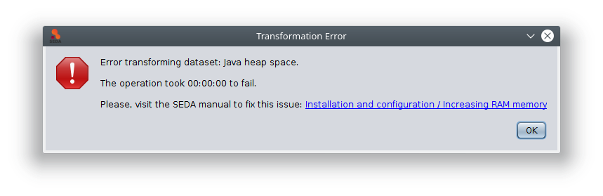

FAQ
***

Is it possible to increase the amount of memory that SEDA uses?
===============================================================

Yes. As the :ref:`Increasing RAM memory<ram_memory>` section explains, the maximum amount of RAM memory that SEDA uses can be increased easily to process larger datasets.

Why does an error saying *"Java heap space"* appears when processing a dataset?
===============================================================================

Sometimes, you may be unable do process datasets obtaining the following error:

This happens because the dataset size exceeds the amount of RAM memory that SEDA can use. To fix this, follow the instructions given in the :ref:`Increasing RAM memory<ram_memory>` section.
