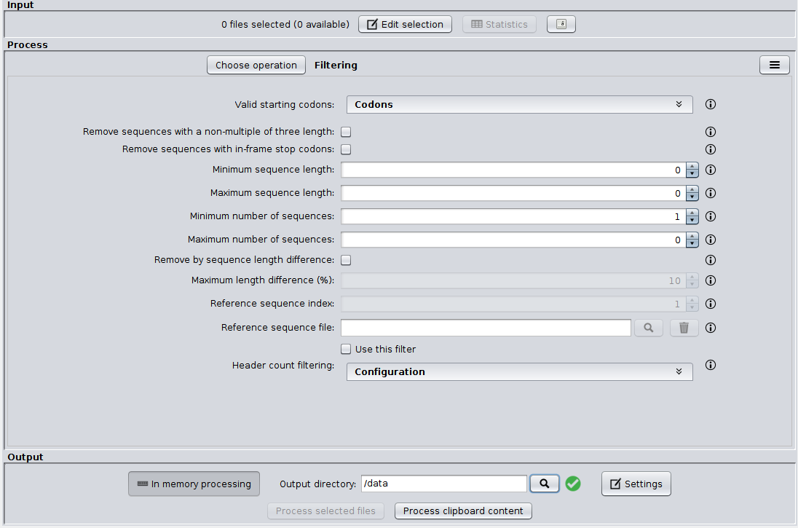
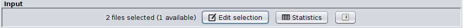
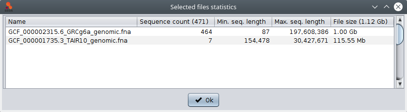
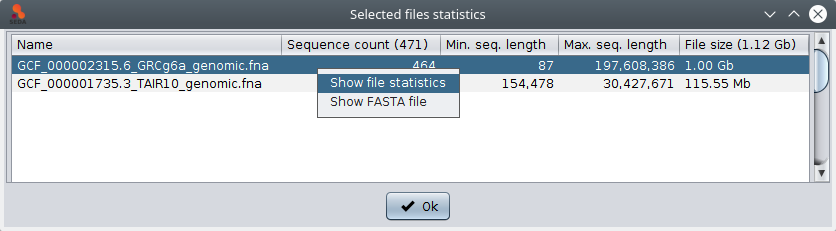
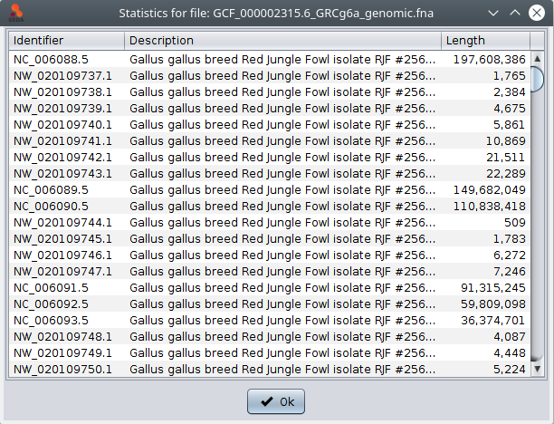
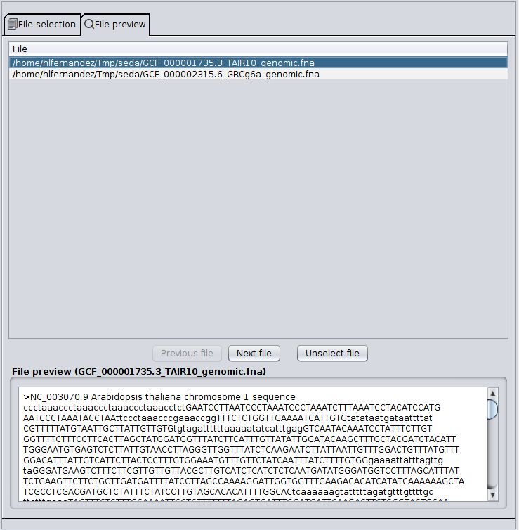
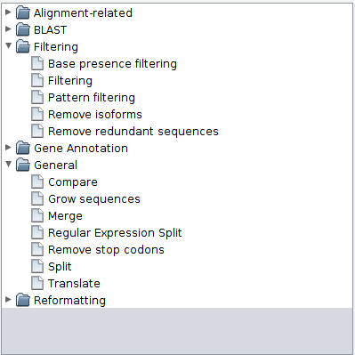

Graphical user interface
************************

As you can see in the image below, the SEDA Graphical User Interface (GUI) has three main areas: *Input*, *Process* and *Output*. The *Input* area allows to select FASTA files. The *Process* area allows to select and configure the operation which should be applied to the selected FASTA files (see section :doc:`operations`). Finally, the *Process* area allows to choose the output directory, configure some output settings and executing the selected operation.

The Input area
==============

The *Input* area allows to select the FASTA files that you want to process. To do so, you must click the *‘Edit selection‘* button, which will show you the file selection dialog. As you can see in the image below, this dialog has two tabs: *File selection* and *File preview*.

The *File selection* tab allows to load files into SEDA using the *‘Load from directory’*, *‘Load files’* and *‘Load file list’* buttons. This latter option allows to select a plain text file containing the paths to the files to load. Loaded files are added to the *‘Available files’* list. The files to which the operation must be applied should be moved from this list to the *‘Selected files’* list using the arrow controls between them. After doing this, you can click the *‘Ok’* button to return to the main SEDA GUI, where you can see that the selection status is updated. The rational for this design is that you can select all files to be processed at once by putting them in the *‘Available Files‘* section, but process them in smaller batches, according to your computer memory settings.

The *‘Statistics’* button shows a table with general information (sequence count, maximum and minimum sequence length) related to the selected files. Note that information in the tables below can be selected and then copied (using the Ctrl+C) and pasted into other applications such as text editor or spreadsheets.

In addition, if you select one file, the *‘Show file statistics’* of the popup menu (which is shown by doing right-click) shows a table containing all the sequences in that file along with their length.

In the *File selection* tab, the following options are also available:

- *Recursive load from directory*: applied when the *‘Load from directory’* option is used, it controls whether the selected directory must be loaded recursively, that is, loading files also from subdirectories, or not.
- *Hide common path*: this option controls whether the common path should be hidden in both file lists or not. When it is not checked, the full paths of the files are shown.
- *Clear available/selected list*: clears the file paths added to the corresponding list.
- *Save available/selected list*: saves the file paths added to the corresponding list into a plain text file. This file can be loaded again in SEDA using the *‘Load file list’* option.

The *File preview* tab allows to preview the first sequence of each file added to the *‘Selected files’* list. You can select the file that you want to preview by clicking on its name or you can use the *‘Previous file’* and *‘Next file’* buttons to iterate over them. The *‘Unselect file’* button moves the current preview file from the *‘Selected files’* list to the *‘Available files’* list.

Finally, the button next to the *‘Statistics’* button (highlighted in blue in the image below) allows to enable or disable the auto-detect encoding mode. This mode is disabled by default, which means that SEDA will use a fast loading algorithm that works with most of the FASTA files without special characters. When this mode is enabled, SEDA will try to automatically identify the charset used by each FASTA file before processing them. Note that this option results in a slower processing and should be used only if you have special characters in your files or if SEDA fails to load your files.

The Process area
================

The *Process* area to select the operation you want to execute. By clicking in the *Choose operation* button, a tree with the available operations will be displayed.

The configuration of each operation is described in detail in the :doc:`operations` section. The button in the top right corner of this area shows a menu that allows to save the current configuration into a text file that can be loaded later (using the same menu) to re-load the same configuration.

The Output area
===============

The *Output* area allows to configure how outputs are produced and telling SEDA to apply the configured operation to the current file selection. This can be done by clicking the *‘Process selected files’* button. This button is enabled when two conditions are met: one or more files are selected and the current operation configuration is right. Otherwise, the button is not enabled. In addition, the *‘Process clipboard content’* button allows to use the current clipboard content as a FASTA file and process it using the configured operation. This button is enabled when the current operation configuration is right.

The *‘Output directory’* parameter specifies where the processed files must be stored. The green tick icon next to it indicates that it does not contain any of the selected files. If this occurs, the icon switches to a red warning icon, in order to warn users that some of the selected files will be overwritten by the operation.

Moreover, the *‘In memory processing’* option allows users to control whether the dataset processing must be done in RAM memory or in hard disk. When the button is selected, data is processed in RAM memory. This is the recommended option for small datasets or computers with a large amount of RAM available. For computers with low RAM memory, the disk processing is recommended.

Finally, the *‘Settings’* button shows the configuration dialog below where you can configure:

- Whether the output files must be compressed using gzip.
- Whether the output files must be split into subdirectories of a defined size. For instance, if a batch of 120 files is processed, with the *‘Split in subdirectories’* option selected and *‘Files by subdirectory’* set to 40, then output files will be divided into three directories with 40 files each.

