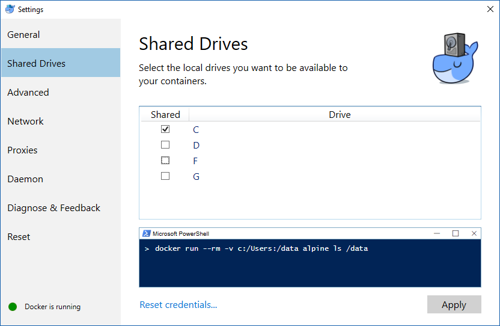

Installation and configuration
******************************
SEDA installers (available at https://www.sing-group.org/seda/download.html) are self-contained and do not require the installation or configuration of additional dependencies to run the SEDA core functionalities. Nevertheless, some operations (e.g. Blast or Clustal Omega alignment) require users to: (i) provide the software binaries so that SEDA can invoke them at runtime, (ii) a Docker installation so that SEDA can run the software dependencies using Docker images.

Docker
======

Linux
-------

Follow the official Docker CE installation instructions for your distribution:
- CentOS (https://docs.docker.com/install/linux/docker-ce/centos/).
- Debian (https://docs.docker.com/install/linux/docker-ce/debian/).
- Fedora (https://docs.docker.com/install/linux/docker-ce/fedora/).
- Ubuntu (https://docs.docker.com/install/linux/docker-ce/ubuntu/).

It is recommended to follow the post-installation steps (https://docs.docker.com/install/linux/linux-postinstall/) in order to manage Docker as non-root user. Otherwise, SEDA should be executed as superuser in order to be able to run Docker.

Windows
-------

Follow the official Docker for Windows installation instructions (https://docs.docker.com/docker-for-windows/). Please, note that SEDA requires Docker for Windows, Docker Toolbox is not supported.

Regarding the Docker for Windows configuration, access must be explicitely granted to the drive where the user temporary folder is located (usually *C*), as the following image shows.

Mac OS
------

Follow the official Docker for Mac installation instructions (https://docs.docker.com/docker-for-mac/). Please, note that SEDA requires Docker for Mac, Docker Toolbox is not supported.

.. _dependencies:

Dependencies
============

Some operations require third-party software (e.g. Blast) in order to work. This section describes the dependencies required by SEDA. If Docker is available, then SEDA can run these software dependencies using Docker images (we recommend using the official iamges provided and maintained by us, although custom images can be used).

BLAST
-----

BLAST operations in SEDA make use of the following commands: makeblastdb, blastdb_aliastool, blastdbcmd, blastp, blastn, blastx, tblastn, and tblastx. BLAST binaries are available here: https://blast.ncbi.nlm.nih.gov/Blast.cgi?CMD=Web&PAGE_TYPE=BlastDocs&DOC_TYPE=Download. SEDA was developed and tested using the version **2.6.0-1**, which is the version included in the official Docker image (https://hub.docker.com/r/singgroup/seda-blast).

Clustal Omega
-------------

Clustal Omega binaries are available here: http://www.clustal.org/omega/#Download. SEDA was developed and tested using the version **1.2.4**, which is the version included in the official Docker image (https://hub.docker.com/r/singgroup/seda-clustalomega/dockerfile).

ProSplign/ProCompart
--------------------

The original ProSplign and ProCompart binaries are available here: https://www.ncbi.nlm.nih.gov/sutils/static/prosplign/prosplign.html. Nevertheless, SEDA requires the following version in order to work properly: http://static.sing-group.org/software/SEDA/dev_resources/pro-ncbi.tar.gz. This version is the one included in the official Docker image (https://hub.docker.com/r/singgroup/seda-prosplign-procompart).
