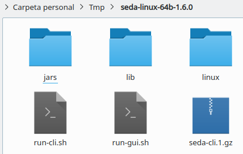
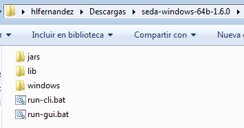

Installation and configuration
******************************

SEDA installers (available at https://www.sing-group.org/seda/download.html) are self-contained and do not require the installation or configuration of additional dependencies to run the SEDA core functionalities.

Nevertheless, some operations (e.g. BLAST or Clustal Omega alignment) make use of external software dependencies and require users: (i) to have a Docker installation so that SEDA can run the software dependencies using Docker images, or (ii) to provide the location of the software binaries so that SEDA can invoke them at runtime.

We recommend using Docker since it can be installed on the main operating systems easily and allows to run these dependencies using the official images provided and maintained by us, avoiding you to have them installed and configured locally (sometimes that is not always possible since some of them are not available for Windows or Mac OS).

SEDA Installation
=================

Hardware requirements
---------------------

Since SEDA runs on Java 8, it has no special CPU requirements as today's computers are able to execute it. RAM memory requirements would depend on the size of the files to be processed. The SEDA interface includes an *‘In memory processing’* option that allows to control whether the dataset processing must be done in RAM memory or in hard disk. When the button is selected, data is processed in RAM memory and thus SEDA should have enough memory to fit the entire dataset in memory. This is the recommended option for small datasets or computers with a large amount of RAM available. For computers with low RAM memory, the *'Disk processing'* is recommended. By default, SEDA relies on the default RAM memory settings of the Java Virtual Machine in Linux and MAC OS systems and uses a default of 4Gb in Windows systems, although specific RAM memory settings can be specified as the :ref:`Increasing RAM memory<ram_memory>` section explains.

Linux
-----

Portable version
^^^^^^^^^^^^^^^^

Download and uncompress the 64 bit distribution for Linux (*seda-linux-64b-X.Y.Z.tar.gz*). The following files will appear.



Now, make double click on the *run.sh* file (or execute ```./run.sh```) in order to run SEDA.

See the :ref:`Linux Docker<linux_docker>` section to see how to install Docker in Linux and be able to use the operations requiring external software dependencies.

.. Note::
   The first time an operation requiring external software dependencies is opened and Docker is available, the waiting cursor appears and it may seem that the GUI is frozen. This is normal because SEDA should download the Docker image from the Docker Hub registry and this may take a while depending on the speed of your internet connection.

Dockerized version
^^^^^^^^^^^^^^^^^^

A dockerized version of SEDA for Linux systems is available at https://hub.docker.com/r/pegi3s/seda/. Using this Docker image, SEDA can be run with the following commands:

.. code-block:: console

 xhost +
 docker run --rm -ti -e USERID=$UID -e USER=$USER -e DISPLAY=$DISPLAY -v /var/db:/var/db:Z -v /tmp/.X11-unix:/tmp/.X11-unix -v $HOME/.Xauthority:/home/developer/.Xauthority -v "/your/data/dir:/data" -v /var/run/docker.sock:/var/run/docker.sock -v /tmp:/tmp pegi3s/seda

Where ```/your/data/dir``` must be replaced with the data directory that SEDA will have access to and that will be available as ```/data```.

Windows
-------

Portable version
^^^^^^^^^^^^^^^^

Download and uncompress the 64 bit distribution for Windows (*seda-windows-64b-X.Y.Z.zip*). The following files will appear.



Now, make double click on the *run.bat* file in order to run SEDA. In some cases, a message like the one below may appear. If so, just click on *More info* and then you will be able to click the *Run anyway* button to continue opening SEDA.


See the :ref:`Windows Docker<windows_docker>` section to see how to install Docker for Windows and be able to use the operations requiring external software dependencies.

.. Note::
   The first time an operation requiring external software dependencies is opened and Docker is available, the waiting cursor appears and it may seem that the GUI is frozen. This is normal because SEDA should download the Docker image from the Docker Hub registry and this may take a while depending on the speed of your internet connection.

Executable installer
^^^^^^^^^^^^^^^^^^^^

First, make double click on the *seda-windows-64b-X.Y.Z.exe* file in order to run the SEDA installer. In some cases, a message like the one below may appear. If so, just click on *More info* and then you will be able to click the *Run anyway* button to continue the SEDA installation.

.. figure:: images/installation/windows/installer/1.png
   :align: center

Then, you just only need to follow the installation wizard steps until the instalation is completed.


And finally, just check the *Run SEDA* option to check that the installation has succeeded.

.. figure:: images/installation/windows/installer/8.png
   :align: center

See the :ref:`Windows Docker<windows_docker>` section to see how to install Docker for Windows and be able to use the operations requiring external software dependencies.

.. Note::
   The first time an operation requiring external software dependencies is opened and Docker is available, the waiting cursor appears and it may seem that the GUI is frozen. This is normal because SEDA should download the Docker image from the Docker Hub registry and this may take a while depending on the speed of your internet connection.

Mac OS
------

Download and uncompress the Mac OS distribution (*seda-mac-X.Y.Z.zip*). The following files will appear.


Now, make double click on the *run.command* file in order to run SEDA. In some cases, the system will prompt the following dialog saying that the application can't be opened due to the security settings.


To fix this, go to *System Preferences* and find the *Security & Privacy* settings.


In the *General* tab, enable the *App Store and identified developers* option under the *Allow apps downloaded from* text.


Finally, make double click again on the *run.command* file in order to run SEDA. When prompted, click the *Open* button to open SEDA.


See the :ref:`Mac OS Docker<mac_docker>` section to see how to install Docker for Mac and be able to use the operations requiring external software dependencies.

.. Note::
   The first time an operation requiring external software dependencies is opened and Docker is available, the waiting cursor appears and it may seem that the GUI is frozen. This is normal because SEDA should download the Docker image from the Docker Hub registry and this may take a while depending on the speed of your internet connection.

Docker installation
===================

.. _linux_docker:

Linux
-------

Follow the official Docker CE installation instructions for your distribution:

- CentOS (https://docs.docker.com/install/linux/docker-ce/centos/).
- Debian (https://docs.docker.com/install/linux/docker-ce/debian/).
- Fedora (https://docs.docker.com/install/linux/docker-ce/fedora/).
- Ubuntu (https://docs.docker.com/install/linux/docker-ce/ubuntu/).

It is recommended to follow the post-installation steps (https://docs.docker.com/install/linux/linux-postinstall/) in order to manage Docker as non-root user. Otherwise, SEDA should be executed as superuser in order to be able to run Docker.

.. _windows_docker:

Windows
-------

Follow the official Docker for Windows installation instructions (https://docs.docker.com/docker-for-windows/). Please, note that SEDA requires Docker for Windows, Docker Toolbox is not supported.

Regarding the Docker for Windows configuration, access must be explicitely granted to the drive where the user temporary folder is located (usually *C*), as the following image shows.


.. _mac_docker:

Mac OS
------

Follow the official Docker for Mac installation instructions (https://docs.docker.com/docker-for-mac/). Please, note that SEDA requires Docker for Mac, Docker Toolbox is not supported.

.. _dependencies:

Dependencies
============

As explained before, some operations require third-party software (e.g. BLAST) in order to work. This section describes the dependencies required by SEDA. If Docker is available, then SEDA can run these software dependencies using Docker images (we recommend using the official iamges provided and maintained by us, although custom images can be used).

+----------------------+--------+-----+-----+--------------------------+
| BLAST                | 2.6.0  | Yes | Yes | Yes                      |
+======================+========+=====+=====+==========================+
| Clustal Omega        | 1.2.4  | Yes | Yes | Yes                      |
+----------------------+--------+-----+-----+--------------------------+
| bedtools             | 2.25.0 | Yes | No  | Yes (MacPorts, Homebrew) |
+----------------------+--------+-----+-----+--------------------------+
| EMBOSS               | 6.6.0  | Yes | No  | Yes (Native, Homebrew)   |
+----------------------+--------+-----+-----+--------------------------+
| Splign/Compart       | N/A    | Yes | No  | No                       |
+----------------------+--------+-----+-----+--------------------------+
| ProSplign/ProCompart | N/A    | Yes | No  | No                       |
+----------------------+--------+-----+-----+--------------------------+

BLAST
-----

BLAST operations in SEDA make use of the following commands: makeblastdb, blastdb_aliastool, blastdbcmd, blastp, blastn, blastx, tblastn, and tblastx. BLAST binaries are available here: https://blast.ncbi.nlm.nih.gov/Blast.cgi?CMD=Web&PAGE_TYPE=BlastDocs&DOC_TYPE=Download. SEDA was developed and tested using the version **2.6.0-1**, which is the version included in the official Docker image (https://hub.docker.com/r/singgroup/seda-blast).

Clustal Omega
-------------

Clustal Omega binaries are available here: http://www.clustal.org/omega/#Download. SEDA was developed and tested using the version **1.2.4**, which is the version included in the official Docker image (https://hub.docker.com/r/singgroup/seda-clustalomega/dockerfile).

bedtools
--------

Bedtools binaries are available here: https://bedtools.readthedocs.io/en/latest/content/installation.html. SEDA was developed and tested using the version **2.25.0**, which is the version included in the official Docker image (https://hub.docker.com/r/singgroup/seda-clustalomega/dockerfile).

EMBOSS
------

EMBOSS-based operations in SEDA make use of the getorf command. EMBOSS binaries are available here: http://emboss.sourceforge.net/download/. EMBOSS was developed and tested using the version **6.6.0**, which is the version included in the official Docker image (https://hub.docker.com/r/singgroup/seda-emboss).

Splign/Compart
--------------

The original Splign and Compart binaries are available here: https://www.ncbi.nlm.nih.gov/sutils/splign/splign.cgi?textpage=downloads. Nevertheless, it is recommended to use the following binaries: http://static.sing-group.org/software/SEDA/dev_resources/splign-compart.tar.gz. This version is the one included in the official Docker image (https://hub.docker.com/r/singgroup/seda-splign-compart).

ProSplign/ProCompart
--------------------

The original ProSplign and ProCompart binaries are available here: https://www.ncbi.nlm.nih.gov/sutils/static/prosplign/prosplign.html. Nevertheless, SEDA requires the following version in order to work properly: http://static.sing-group.org/software/SEDA/dev_resources/pro-ncbi.tar.gz. This version is the one included in the official Docker image (https://hub.docker.com/r/singgroup/seda-prosplign-procompart).

SAPP
----

The original SAPP binaries are available here: http://sapp.gitlab.io/installation/. Nevertheless, it is recommended to use the following binaries: http://static.sing-group.org/software/SEDA/dev_resources/sapp.tar.gz. This version is the one included in the official Docker image (https://hub.docker.com/r/singgroup/seda-sapp).

.. _ram_memory:

Increasing RAM memory
=====================

Windows
-------

The RAM memory used by SEDA can be increased by editing the *run.bat* file that can be found the installation directory. In this file, you can edit the value of the *SEDA_JAVA_MEMORY* parameter declared at the beginning which, by default, is set to 4Gb. To process larger datasets, this amount can be increased up to a value near to computer's available RAM (for example, if you have 8Gb of RAM, you can set this parameter to *-Xmx6G* or *-Xmx8G*).

Linux and Mac OS
----------------

The RAM memory used by SEDA can be increased by editing the *run.sh* (Linux) or *run.command* (MAC OS) files that can be found the installation directory. In these files, you can set the value of the *SEDA_JAVA_MEMORY* parameter declared at the beginning by uncommenting the corresponding line. By default, this parameter is unset and this means that SEDA will use the default maximum RAM memory settings of your system. To process large datasets, this amount can be increased up to a value near to computer's available RAM (for example, if you have 8Gb of RAM, you can set this parameter to *-Xmx6G* or *-Xmx8G*).

Alternatively, you can set an environment variable named *SEDA_JAVA_MEMORY* with this setting. In Linux systems, this can be done by running ``export SEDA_JAVA_MEMORY=-Xmx6G``.

Linux Dockerized version
------------------------

To increase the RAM memory that the dockerized version of SEDA for Linux systems uses, simply add ``-e SEDA_JAVA_MEMORY='-Xmx6G'`` to the ``docker run`` command:

.. code-block:: console

 xhost +
 docker run --rm -ti -e SEDA_JAVA_MEMORY='-Xmx6G' -e USERID=$UID -e USER=$USER -e DISPLAY=$DISPLAY -v /var/db:/var/db:Z -v /tmp/.X11-unix:/tmp/.X11-unix -v $HOME/.Xauthority:/home/developer/.Xauthority -v "/your/data/dir:/data" -v /var/run/docker.sock:/var/run/docker.sock -v /tmp:/tmp pegi3s/seda
