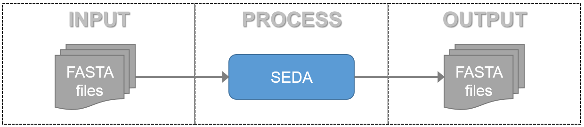

Introduction
************

SEDA (*SEquence DAtaset builder*) is an open-source, multiplatform application for processing FASTA files containing DNA and protein sequences.

As the following image shows, SEDA uses the Input-Process-Output (IPO) model to process sequence files in FASTA format (https://en.wikipedia.org/wiki/FASTA_format). This means that every operation in SEDA takes as input one or more FASTA files and produces one or more FASTA files.

According to the FASTA format, each file may contain one or more sequences. Each sequence is composed by a header line which begins with ‘>’ and one or more lines containing the nucleotide or amino acid sequences represented using single-letter codes. The header of a sequence typically should give a name (unique identifier) for the sequence, and may also contain additional information (called description). The description is separated by a blank space from the sequence name/identifier. The following example shows a sequence in FASTA format.

.. code-block:: console

 >SEQUENCE_NAME_IDENTIFIER Description
 ACTGACTGACTGACTGACTGACTGACTGACTGACTGACTGACTGACTG
 ACTGACTGACTGACTGACTGACTG

To facilitate the usage of the application, SEDA processing operations are grouped in six main groups:

- *Alignment-related*: including functions to align sequences using Clustal Omega, concatenate sequences, and create consensus sequences.
- *BLAST*: including an operation for performing batch BLAST analyses and a two-way ortholog identification method.
- *Filtering*: including different operations to filter sequences (e.g. those that meet some criteria, remove isoforms or duplicated sequences, among others).
- *Gene Annotation*: including gene annotation pipelines based on Augustus as implemented in SAPP, getorf from EMBOSS, Splign/Compart (https://www.ncbi.nlm.nih.gov/sutils/splign/splign.cgi), and ProSplign/ProCompart (https://www.ncbi.nlm.nih.gov/sutils/static/prosplign/prosplign.html).
- *Reformatting*: providing operations to change the format of the FASTA files such as a powerful operation for changing sequence headers, among others.
- *General*: containing operations whose functionality is not related to the other groups (e.g. splitting files and extracting random sequences, DNA to Protein translation, or FASTA files comparison, among others).
