Operations
**********

This section provides an overview on the different processing operations available in SEDA.

Based on the relation between input and output files, operations can be classified in two groups:

- Those that process each input file to produce exactly one output file, which is a modified version of the input file: Filtering, Pattern filtering, Base presence filtering, Remove redundant sequences, Sort, Reallocate reference sequences, Rename header, Reformat file, Grow sequences, NCBI rename, Undo alignment, Disambiguate sequence names, Clustal Omega Alignment, Splign/Compart, and ProSplign/ProCompart.
- Those that produce a different number of output files: Split, Merge, Consensus sequence, Concatenate sequences, Compare, and Blast.

Alignment-related
=================

Clustal Omega Alignment
-----------------------

This operation allows to use Clustal Omega (http://www.clustal.org/omega/) to align the input FASTA files.

First, the *‘Clustal Omega configuration’* area allows to select the execution mode of Clustal Omega: *system binary* indicates that Clustal Omega will be executed directly using its binary and *Docker image* means that a Docker image will be used instead.

In the *system binary* mode, the path to the Clustal Omega binary file must be specified (refer to section :ref:`Dependencies<dependencies>` for additional information about this). If the Clustal Omega binary is in the path (*clustalo* in Unix systems and *clustalo.exe* in Windows systems), then this can be empty and the *Check binary* would say that it is right.

In the *Docker image* mode, the default image is already set, although it is possible to choose a custom one provided that it has the Clustal Omega binary in the system path.

.. figure:: images/operations/clustal-omega-alignment/2.png
   :align: center

The configuration panel also allows to choose:

- *Num. threads*: the number of threads to use.
- *Additional parameters*: additional parameters for the Clustal Omega alignment.

Concatenate sequences
---------------------

This operation allows to merge all the selected input FASTA files into a single output FASTA by concatenating equivalent sequences. The *‘Name’* parameter defines the name for the output file. The *‘Sequence matching mode‘* parameter defines how sequence headers are processed in order to match those equivalent sequences that should be concatenated:

- *'Sequence name'* means that the sequences are "concatenated if they have the same sequence names (identifiers).
- *'Regular expression'* means sequences are concatenated by matching headers using the configuration specified in the *Header matcher configuration* panel.

Additionally, you can specify the FASTA format parameters in the *‘Reformat output file’* area (see section :ref:`Reformat file<operations-reformat-file>` to learn more about this formatting).

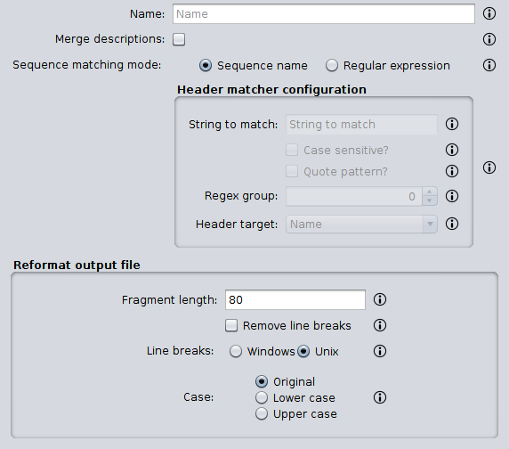

Regarding the *Header matcher configuration* panel, this option allows to configure the regular expression configuration to match the sequence headers that must be concatenated using the following options:

- *String to match*: the regular expression that must be matched in the sequence header.
- *Case sensitive?*: whether the string must be matched as case sensitive or not.
- *Quote pattern?*: whether the regular expression pattern must be quoted or not. When the regular expression is quoted, metacharacters or escape sequences in it will be given no special meaning.
- *Regex group?*: the regular expression group that must be extracted. Default value is *0*, meaning that the entire result must be considered. Use values higher than 0 when there are brackets in the regular expression in order to select the desired group.
- *Header target?*: the part of the sequence header where the string must be found.

Examples
++++++++

The following example illustrates how sequences with the same sequence names in the input FASTA files 1 and 2 are concatenated and written as single output FASTA.

Input 1:

.. code-block:: console

 >Homo_sapiens
 AAAATTTT
 >Mus_musculus
 ACTGACTG

Input 2:

.. code-block:: console

 >Homo_sapiens
 CCCCGGGG
 >Mus_musculus
 GTCAGTCA

Output:

.. code-block:: console

 >Homo_sapiens
 AAAATTTTCCCCGGGG
 >Mus_musculus
 ACTGACTGGTCAGTCA

On the other hand the *'Regular expression'* matching mode allows more complex concatenations. For instance, it can be used in those scenarios where sequences from two or more species are mixed in several FASTA files and one FASTA file containing the equivalent sequences is wanted. Consider the input FASTA files below that contains sequences from three species: *Homo sapiens*, *Gallus gallus*, and *Mus musculus*. When it is processed using the configuration below, one output FASTA file is obtained. Basically, the regular expression *^[^_]*_[^_]** is able to extract the common species names from the headers so that sequences are concatenated based in them.

Input 1:

.. code-block:: console

 >Homo_sapiens_1
 AT
 >Mus_musculus_1
 TT
 >Gallus_gallus_1
 GG

Input 2:

.. code-block:: console

 >Homo_sapiens_2
 CG
 >Mus_musculus_2
 AA
 >Gallus_gallus_2
 CC

Output:

.. code-block:: console

 >Homo_sapiens
 ATCG
 >Mus_musculus
 TTAA
 >Gallus_gallus
 GGCC

Consensus sequence
------------------

This operation allows to create a consensus sequence from a set of sequences of the same length. The consensus sequence is constructed by calculating the most frequent bases, either nucleotide or amino acid, found at each position in the given set of sequences. The configuration panel allows to choose:

- *Sequence type*: the type of sequences in the selected files. For nucleotide sequences, ambiguous positions are indicated using the IUPAC ambiguity codes (http://www.dnabaser.com/articles/IUPAC%20ambiguity%20codes.html). For protein sequences, ambiguous positions are indicated as the *’Verbose’* option explains.
- *Minimum presence*: the minimum presence for a given nucleotide or amino acid in order to be part of the consensus sequence. Those positions where the most frequent base is under this threshold are represented by an *N* (nucleotide sequences) or *X* (protein sequences) in the consensus sequence.
- *Verbose*: in protein sequences, when this option is unselected then *X* is used for ambiguous positions in the consensus sequence. On the other hand, when this option is selected, then all amino acids in such positions are reported (e.g. [HWY]).
- *Reformat output file*: allows to specify the format parameters of the output FASTA containing the consensus sequence (see section :ref:`Reformat file<operations-reformat-file>` to learn more about this formatting).

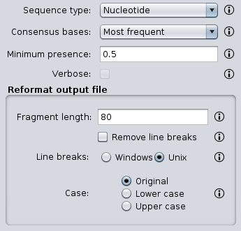

Examples
++++++++

The following example shows how nucleic acid sequences in the input FASTA are processed to create a consensus sequence using two different minimum presence thresholds: 0.2 and 0.6.

Input:

.. code-block:: console

 >Sequence1
 ACCA-C
 >Sequence2
 ACCC-C
 >Sequence3
 ATCT-A
 >Sequence4
 AGGG-A

Output (0.2):

.. code-block:: console

 >consensus
 ACCN-N

Output (0.6):

.. code-block:: console

 >consensus
 ANCN-N

The following example shows how protein sequences in the input FASTA are processed to create a consensus sequence using a threshold of 0.4 and both verbose and not verbose options.

Input:

.. code-block:: console

 >Sequence1
 SSSS
 >Sequence2
 PSSS
 >Sequence3
 HPHS
 >Sequence4
 QPQQ

Output (verbose):

.. code-block:: console

 >consensus
 X[SP]SS

Output (not verbose):

.. code-block:: console

 >consensus
 XXSS

Undo alignment
--------------

This operation allows to undo a sequence alignment by removing ‘-’ from sequences. Additionally, you can specify the FASTA format parameters in the *‘Reformat output files’* area (see section :ref:`Reformat file<operations-reformat-file>` to learn more about this formatting).

The following example shows how ‘-’ are removed from the sequences in the input FASTA file.

Input:

.. code-block:: console

 >Sequence1
 ATGGTCCATGGGTACAAAGGGGT
 >Sequence2
 ATGGTCCAT--GTACAAAGGGG-
 >Sequence3
 -TGGTCCA-GGGTACAAAGGGG-

Output:

.. code-block:: console

 >Sequence1
 ATGGTCCATGGGTACAAAGGGGT
 >Sequence2
 ATGGTCCATGTACAAAGGGG
 >Sequence3
 TGGTCCAGGGTACAAAGGGG

BLAST
=====

Blast
-----

This operation allows to perform different BLAST queries using the selected FASTA files. Regarding the database to use in the queries, there are two possible modes: querying against all the selected FASTA files or querying against each FASTA file separately. Regarding the query, there are also two possibilities: using the sequences in one of the selected FASTA as queries or using the sequences in an external FASTA file as queries. When performing this operation, one blast query is executed for each sequence in the FASTA file.

The figure below illustrates the process followed when a query against all selected FASTA files is performed. Firstly, one blast database is created for each selected FASTA file. Then, one alias referencing to all the databases created before is created. Finally, each sequence in the FASTA file used as query source is executed against the alias. As a result, this mode creates as many output files as sequences in the FASTA file. To create these output files, the sequences where hits were found are retrieved from the database.

On the other hand, the figure below shows the process followed when queries against each selected FASTA file are executed separately. Firstly, one blast database is created for each selected FASTA file. Then, each sequence in the FASTA file used as query source is executed against each of the databases. As a result, this mode creates as many output files as sequences in the FASTA file multiplied by the number of selected FASTA files. To create these output files, the sequences where hits were found are retrieved from the corresponding database.

Configuration
+++++++++++++

First, the *‘Blast configuration’* area allows to select the execution mode of Blast: *system binary* indicates that blast will be executed directly using its binaries and *Docker image* means that a Docker image will be used instead.

In the *system binary* mode, the path where the blast binaries (makeblastdb, blastdb_aliastool, blastdbcmd, blastp, blastn, blastx, tblastn, and tblastx) are located must be specified (refer to section :ref:`Dependencies<dependencies>` for additional information about this). If you have them in the system path, just click the *‘Check binary’* button to make sure that SEDA can correctly execute them.

In the *Docker image* mode, the default image is already set, although it is possible to choose a custom one provided that it has the blast binaries in the system path.

.. figure:: images/operations/blast/4.png
   :align: center

Then, the *‘DB configuration’* area allows to control some aspects related with the databases created in the process. The type of the database is automatically selected according to the blast type to execute. This area allows to indicate whether the databases and alias must be stored in a directory of your choice. Otherwise, temporary directories are used and they are deleted at the end of the process. Nevertheless, it may be interesting to store the databases for two reasons: use them again in SEDA or use them in BDBM (Blast DataBase Manager, http://www.sing-group.org/BDBM/). SEDA can reuse databases since if databases with the same name exist in the selected directory they are not created again.

Finally, the *‘Query configuration’* area allows to control how queries are performed. As explained before, first you must choose the query mode in the *‘Query against’* parameter. Secondly, you must choose the blast type that you want to perform using the *‘Blast type’* parameter. By selecting the blast type: (*i*) the type of database is automatically determined, and (*ii*) if *blastx* or *tblastn* types are selected, then you will only be allowed to select a query from an external file because the selected files used to construct the database cannot be used as query (blastx uses a database of proteins and a query of nucleotides and tblastn uses a database of nucleotides and a query of proteins).

Thirdly, the *‘Query source’* allows to select the source of the query file:

- *From selected file*: this option allows to select one of the selected files in SEDA using the *‘File query’* combobox.
- *From external file*: this option allows to select an external FASTA file to be used as query file.

Then, three parameters allow to control the query execution:

- *Expectation value*: the expectation value (E) threshold for saving hits.
- *Max. target. seqs*: the maximum number of aligned sequences to keep.
- *Additional parameters*: additional parameters for the blast command.

And finally, the *‘Extract only hit regions’* parameter allows to define how output sequences are obtained. By default, this option is not selected, meaning that the whole subject sequences where hits were found are used to construct the output FASTA files. If this option is selected, then only the part of the subject sequences where the hits were produced are used to construct the output FASTA files. Within this option, the *‘Hit regions window’* parameter allows to specify the number of bases before and after the hit region that should be retrieved.

Blast: two-way ortholog identification
--------------------------------------

This operation allows to find the orthologs of a given sequence in a set of FASTA files. The figure below illustrates the process followed by this operation. For each sequence in a reference FASTA, this operation looks for its orthologs in the set of genomes. For each sequence in the reference FASTA, the following process is applied:

1. A blast query against the first FASTA (hereafter, the reference FASTA) is performed using the reference sequence as query. Only the first hit is considered.
2. The sequence associated to the first hit in the target FASTA is used as query in a second blast query against the reference FASTA. Again, only the first is considered.
3. The sequence associated to the first hit in the reference FASTA is compared to the iteration sequence:

	A. If both sequences are the same, then the sequence found in step 2 is reported as ortholog.
	B. If both sequences are different, then the sequence found in step 2 is reported as ortholog if the *Report non-exact orthologues* is being used.

4. Steps 1 to 3 are repeated for each target FASTA available.

Configuration
+++++++++++++

First, the *‘Blast configuration’* area allows to select the execution mode of Blast: *system binary* indicates that blast will be executed directly using its binaries and *Docker image* means that a Docker image will be used instead.

In the *system binary* mode, the path where the blast binaries (makeblastdb, blastdb_aliastool, blastdbcmd, blastp, blastn, blastx, tblastn, and tblastx) are located must be specified (refer to section :ref:`Dependencies<dependencies>` for additional information about this). If you have them in the system path, just click the *‘Check binary’* button to make sure that SEDA can correctly execute them.

.. figure:: images/operations/blast-two-way/2.png
   :align: center

In the *Docker image* mode, the default image is already set, although it is possible to choose a custom one provided that it has the blast binaries in the system path.

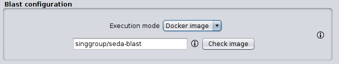

Then, the *‘DB configuration’* area allows to control some aspects related with the databases created in the process. The type of the database is automatically selected according to the blast type to execute. This area allows to indicate whether the databases must be stored in a directory of your choice. Otherwise, temporary directories are used and they are deleted at the end of the process. Nevertheless, you may be interested in storing the databases because SEDA can reuse them in the future: if databases with the same name exist in the selected directory they are not created again.

Finally, the *‘Query configuration’* area allows to control how queries are performed. First, you can choose the ortholog report mode using the *‘Mode‘* parameter and choose *‘Report exact orthologues’* or *‘Report non-exact orthologues’*. Secondly, you must choose the blast type that you want to perform using the *‘Blast type’* parameter. By selecting the blast type: (*i*) the type of database is automatically determined, and (*ii*) if *blastx* or *tblastn* types are selected, then you will only be allowed to select a query from an external file because the selected files used to construct the database cannot be used as query (blastx uses a database of proteins and a query of nucleotides and tblastn uses a database of nucleotides and a query of proteins).

Thirdly, the *‘Query source’* allows to select the source of the query file:

- *From selected file*: this option allows to select one of the selected files in SEDA using the *‘File query’* combobox.
- *From external file*: this option allows to select an external FASTA file to be used as query file.

And finally, two parameters allow to control the query execution:

- *Expectation value*: the expectation value (E) threshold for saving hits.
- *Additional parameters*: additional parameters for the blast command.

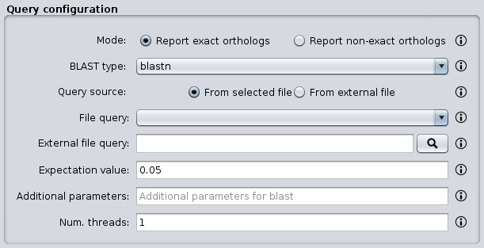

.. _operations-pattern-filtering:

Filtering
=========

Base presence filtering
-----------------------

This operation allows filtering sequences based on the percentages of their bases (nucleotides or amino acids). By using the configuration panel shown below, you can add one or more bases and specify their minimum and maximum percentages. Sequences with bases whose percentage of presence is outside the specified thresholds are removed. Moreover, if you specify several bases in a single row then the sum of each percentage is used for checking the thresholds.

Examples
++++++++

Consider the following input FASTA file with two sequences:

Input:

.. code-block:: console

 >Sequence1
 AAAAAACCCCCTTTGGGA
 >Sequence2
 AAAAAACCCTGGNNNNNN

The percentages of presence of sequence bases are:

- Sequence1:

  - A: 0.38 (7/18)
  - C: 0.27(5/18)
  - T: 0.16 (3/18)
  - G: 0.16 (3/18)

- Sequence2:

  - A: 0.33 (6/18)
  - C: 0.16 (3/18)
  - T: 0.05 (1/18)
  - G: 0.11 (2/18)
  - N: 0.33 (6/18)

For instance, to filter the input FASTA in order to obtain only those sequences with a percentage of A’s between 0.35 and 0.40, the following configuration should be used. In this case, only the first sequence will be in the output file.

For instance, to filter the input FASTA in order to obtain only those sequences with a percentage of T’s or G’s between 0.10 and 0.20, the following configuration should be used. In this case, only the second sequence will be in the output file since the sum of T’s and G’s is 0.16 while in the first sequence is 0.32.

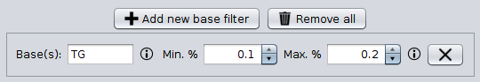

Filtering
---------

This operation allows filtering sequences based on different criteria (e.g. sequence length, non-multiple of three, or in-frame stop codons presence, among others).

The image below shows the configuration panel of the *Filtering operation*. If more than one option is selected, they are applied in the following order:

1. Valid starting codons: filters sequences so that only those starting with the selected codons are kept.
2. Remove stop codons: removes stop codons from the end of the sequences.
3. Remove sequences with a non-multiple of three size: filters sequences so that only those having a length that is multiple of 3 are kept.
4. Remove sequences with in-frame stop codons: filters sequences so that only those without in-frame stop codons are kept.
5. Minimum sequence length: filters sequences so that only those with the specified minimum sequence length are kept. A value of 0 indicates that no minimum sequence length is required.
6. Maximum sequence length: filters sequences so that only those with the specified maximum sequence length are kept. A value of 0 indicates that no minimum sequence length is required.
7. If the header count filtering option is selected at the sequences level, then it filters sequences so that only those meeting the specified criteria regarding header counts are kept. See the examples to learn how to use this filter.
8. Minimum number of sequences: filters files so that only those with the specified minimum number of sequences are kept.
9. Maximum number of sequences: filters files so that only those with the specified maximum number of sequences are kept.
10. If the header count filtering option is selected at the files level, then it filters files so that only those where all sequences meet the specified criteria regarding header counts are kept. See the examples to learn how to use this filter.
11. Remove by size difference: filters sequences so that only those with the specified difference when compared to the reference sequence are kept.

  a)	Maximum size difference (%): the maximum sequence length difference allowed expressed as a percentage.
  b)	Reference sequence index: the index of the sequence to use as reference to compare to others. The first sequence corresponds to index 1. This option is ignored if a reference sequence file (next option) is selected.
  c)	Reference sequence file: the file containing the sequence to use as reference to compare to others. If a file is selected, then the reference sequence index is ignored.

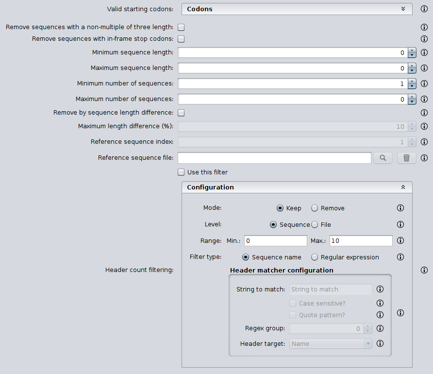

Examples
++++++++

Valid starting codons
^^^^^^^^^^^^^^^^^^^^^

By clicking on the *‘Codons‘* label, a list with the possible starting codons is shown, allowing to select one or more starting codons.

The following example shows how the input FASTA is filtered to keep only those starting with *ATG*.

Input:

.. code-block:: console

 >Sequence1
 TGCCAGAGAACTGCCGGTGTGGTG
 >Sequence2
 ATGTCTTCCATTAAGATTGAGTGT
 >Sequence3
 GCACCAGGGGGCCCTGTACTCCCT

Output:

.. code-block:: console

 >Sequence2
 ATGTCTTCCATTAAGATTGAGTGT

Remove stop codons
^^^^^^^^^^^^^^^^^^

The following example shows how sequences in the input FASTA are modified to remove stop codons from the end of the sequence. Note that this option actually modifies the input sequences.

Input:

.. code-block:: console

 >Sequence1
 TTGCTCCCTACTCCTATGCGGGATGA
 >Sequence2
 TTGCTCCCTACTCCTATGCGGGATAA

Output:

.. code-block:: console

 >Sequence1
 TTGCTCCCTACTCCTATGCGGGA
 >Sequence2
 TTGCTCCCTACTCCTATGCGGGA

Remove sequences with a non-multiple of three size
^^^^^^^^^^^^^^^^^^^^^^^^^^^^^^^^^^^^^^^^^^^^^^^^^^

This example shows how sequences with a non-multiple of three size are removed from the input FASTA. Only *Sequence1* and *Sequence2*, with 15 bases, appears in the output FASTA. *Sequence3* is removed since it has 17 bases.

Input:

.. code-block:: console

 >Sequence1
 CATTAAGATTGAGTG
 >Sequence2
 AATTAAGATTGAGAA
 >Sequence3
 CATTAAGATTGAGTGCTG

Output:

.. code-block:: console

 >Sequence1
 CATTAAGATTGAGTG
 >Sequence2
 AATTAAGATTGAGAA

Remove sequences with in-frame stop codons
^^^^^^^^^^^^^^^^^^^^^^^^^^^^^^^^^^^^^^^^^^

This example shows how sequences containing in-frame stop codons are removed from the input FASTA. Only *Sequence2* does not contain in-frame stop codons, so that it is the only one in the output FASTA.

Input:

.. code-block:: console

 >Sequence1
 CATTAAGATTGAGTG
 >Sequence2
 CATTCGGATTGAGTG

Output:

.. code-block:: console

 >Sequence2
 CATTCGGATTGAGTG

Minimum sequence length
^^^^^^^^^^^^^^^^^^^^^^^

This example shows how sequences with a length below 7 are removed from the input FASTA. Thus, only "Sequence3", with 15 bases, appears in the output FASTA. "Sequence1" and "Sequence2" are removed since they have 4 and 6 bases respectively.

Input:

.. code-block:: console

 >Sequence1
 CATT
 >Sequence2
 CATTAT
 >Sequence3
 CATTAAGATTGAGTG

Output:

.. code-block:: console

 >Sequence3
 CATTAAGATTGAGTG

Maximum sequence length
^^^^^^^^^^^^^^^^^^^^^^^

This example shows how sequences with a length above 5 are removed from the input FASTA. Thus, only *Sequence1*, with 4 bases, appears in the output FASTA. *Sequence2* and *Sequence3*  are removed since they have 6 and 15 bases respectively.

Input:

.. code-block:: console

 >Sequence1
 CATT
 >Sequence2
 CATTAT
 >Sequence3
 CATTAAGATTGAGTG

Output:

.. code-block:: console

 >Sequence1
 CATT

Remove by size difference
^^^^^^^^^^^^^^^^^^^^^^^^^

This example shows how sequences with a length difference compared to the first sequence (Reference sequence index = 1) less than 10% are removed from the input FASTA. Sequence lengths and the differences compared to the reference sequence are:

- *Sequence1*: 25 bases.
- *Sequence2*: 24 bases. Difference: 1 → 1/25: 4%.
- *Sequence3*: 23 bases. Difference: 2 → 2/25: 8%.
- *Sequence4*: 22 bases. Difference: 3 → 3/25: 12%.
- *Sequence5*: 21 bases. Difference: 4 → 4/25: 16%.

Thus, only *Sequence1*, *Sequence2* and *Sequence3* are kept in the output FASTA.

Input:

.. code-block:: console

 >Sequence1
 TGCCAGAGAACTGCCGGTGTGGTGA
 >Sequence2
 TGCCAGAGAACTGCCGGTGTGGTA
 >Sequence3
 TCGCCAGCGCCCTCGGCCACACA
 >Sequence4
 TCGCCAGCGCCCTCGGCCACAA
 >Sequence5
 TCGCCAGCGCCCTCGGCCACA

Output:

.. code-block:: console

 >Sequence1
 TGCCAGAGAACTGCCGGTGTGGTGA
 >Sequence2
 TGCCAGAGAACTGCCGGTGTGGTA
 >Sequence3
 TCGCCAGCGCCCTCGGCCACACA

Header count filtering (I)
^^^^^^^^^^^^^^^^^^^^^^^^^^

This example shows how to use this filter in order to remove all sequences in the input FASTA whose sequence identifier appears exactly two times among all sequences.

By using the configuration above, only *Sequence1* and *Sequence3* are kept in the output FASTA. If the same is applied at the files level, then the input FASTA would not appear in the output directory.

Input:

.. code-block:: console

 >Sequence1
 TGCCAGAGAACTGCCGGTGTGGTGA
 >Sequence1
 TGCCAGAGAACTGCCGGTGTGGTGG
 >Sequence2
 AAAAACTGGAAAAAACTGGAAAACC
 >Sequence3
 TCGCCAGCGCCCTCGGCCACAGA
 >Sequence3
 TCGCCAGCGCCCTCGGCCACATG

Output:

.. code-block:: console

 Sequence1
 TGCCAGAGAACTGCCGGTGTGGTGA
 >Sequence1
 TGCCAGAGAACTGCCGGTGTGGTGG
 >Sequence3
 TCGCCAGCGCCCTCGGCCACAGA
 >Sequence3
 TCGCCAGCGCCCTCGGCCACATG

Header count filtering (II)
^^^^^^^^^^^^^^^^^^^^^^^^^^^

This example shows how to use this filter in order to remove all sequences in the input FASTA for which a word defined by a regular expression does not appear one or two times.

Input:

.. code-block:: console

 >Homo_sapiens_1
 TGCCAGAGAACTGCCGGTGTGGTGA
 >Homo_sapiens_2
 TGCCAGAGAACTGCCGGTGTGGTGG
 >Homo_sapiens_3
 AAAAACTGGAAAAAACTGGAAAACC
 >Mus_musculus_1
 TCGCCAGCGCCCTCGGCCACAGA
 >Gallus_gallus_1
 TCGCCAGCGCCCTCGGCCACATG
  >Gallus_gallus_2
 TCGCCAGCGCCCTCGGCCACATG

By using the configuration below to filter the input FASTA above, the regular expression  *^[^_]*_[^_]** splits the sequences in three groups:

- Those containing *Homo_sapiens*: *Homo_sapiens_1*, *Homo_sapiens_2*, and *Homo_sapiens_3*.
- Those containing *Mus_musculus*: *Mus_musculus_1*.
- Those containing *Gallus_gallus*: *Gallus_gallus_1* and *Gallus_gallus_2*.

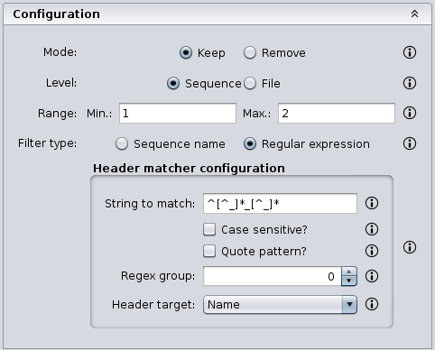

The operation filters the sequences so that only those for which their corresponding groups have a size between 1 and 2 are present in the output FASTA.

Output:

.. code-block:: console

 >Mus_musculus_1
 TCGCCAGCGCCCTCGGCCACAGA
 >Gallus_gallus_1
 TCGCCAGCGCCCTCGGCCACATG
 >Gallus_gallus_2
 TCGCCAGCGCCCTCGGCCACATG

Pattern filtering
-----------------

This operation allows to filter sequences based on a text pattern (note that this pattern can be also a regular expression, see section :ref:`Pattern configuration<advanced-pattern-configuration>` for further details). Filtering can be applied to either sequence headers or the sequence content.

The image below shows the configuration panel of the *Pattern filtering* operation. This configuration panel allows to configure how the pattern filtering is applied:

- *Header* or *Sequence*: check Sequence to look for the pattern on the sequence content or Header to look for the pattern on the sequence header.
- *Convert to amino acid sequence before pattern matching*: when filtering sequences based on the sequence content, it is also possible to indicate that the sequences must be converted to amino acid sequences before applying the pattern. See below for further information on this configuration. Please note that nucleotide sequences containing ambiguity codes will not be translated generating an error.
- *Pattern*: SEDA allows to define patterns in different ways. Refer to section :ref:`Pattern configuration<advanced-pattern-configuration>` to learn how to create patterns.

When filtering nucleotide sequences based on amino acid patterns, the *‘Convert to amino acid sequence before pattern matching* option should be enabled. This option allows to configure the translation mode using the panel below.

This panel allows to specify:

- The frame in which translation should start. You can choose between:

  - *Starting at fixed frame*: by selecting this option, sequences are translated starting at the specified frame.
  - *Considering frames 1, 2 and 3*: by selecting this option, three translations starting at frames 1, 2 and 3 are created. This way, the pattern is applied to each translation separately and it is considered present if it is present in any of the translations.

    - If the *‘Join frames’* option is used, then the three translations are concatenated before testing the pattern. This is useful if a set of sequences is being processed and the composed pattern should be found in any of the frames, one part of the pattern being present in one frame and another part in a different frame, as in the case of intron containing gene sequences.

- *Use a custom codon code*: this option allows selecting a file containing a custom DNA codon table. This option is unselected by default and in this case SEDA uses the standard genetic code. A custom codon code must be given in the following format:

.. code-block:: console

	TTT=T
	CTT=C
	GCA=A

- *Use reverse complement sequences*: whether reverse complement of sequences is used before translation or not. If not selected, sequences are used as they are introduced.

Examples
++++++++

The following example shows how an input FASTA is filtered to obtain only those sequences containing at least one *ACTG*.

Input:

.. code-block:: console

 >Sequence1
 AGGGTTTAGCCAACTGCTGCAGCA
 >Sequence2
 AGGGTTTAGCCAACGCCTGCAGCA
 >Sequence3
 CTACTGGAATAGAACCTCTGGAAT
 >Sequence4
 CTATGGAATAGAACCTCTGGAATC

Output:

.. code-block:: console

 >Sequence1
 AGGGTTTAGCCAACTGCTGCAGCA
 >Sequence3
 CTACTGGAATAGAACCTCTGGAAT

In the following example, sequences are filtered based on their headers. By using the pattern *Homo_sapiens*, only two sequences are kept in the output FASTA.

Input:

.. code-block:: console

 >Mus_musculus_1
 TGCCAGAGAACTGCCGGTGTGGTG
 >Homo_sapiens_1
 ATGTCTTCCATTAAGATTGAGTGT
 >Mus_musculus_2
 GCACCAGGGGGCCCTGTACTCCCT
 >Homo_sapiens_2
 CGCGCAGCCGTCTTTGACCTTGAT

Output:

.. code-block:: console

 >Homo_sapiens_1
 ATGTCTTCCATTAAGATTGAGTGT
 >Homo_sapiens_2
 CGCGCAGCCGTCTTTGACCTTGAT

Remove isoforms
---------------

This operation allows to detect and remove isoforms in each input FASTA file. This operation applies the following algorithm to detect and remove isoforms:

1.	Start with the first sequence (*FS*) and compare it against the remaining ones.
2.	For each pair of sequences (*FS* vs *SS*), it is considered that they are isoforms if they share a word of the specified length (*Minimum word length*).
3. 	If they are isoforms, the second sequence (*SS*) is marked as isoform of the first sequence (*FS*) so that *SS* will not be taken for further comparisons.
4. 	Repeat steps 1 to 3 for the remaining sequences.
5.	Now, for each group of isoforms, the *Isoform selection criteria* is applied to select which isoform should go to the output file.

This algorithm is applied to all sequences in each input FASTA file. Nevertheless, by using the *Header matcher configuration*, it is possible to split them in groups that will be processed separately. This option is meant for those scenarios where sequences from two or more species are mixed in the same FASTA file and this operation should be applied to each species separately.

The configuration panel allows to set the parameters of the operation:

- *Minimum word length*: the minimum length of word to consider that two sequences are isoforms.
- *Isoform files directory*: whether the removed isoform names should be saved into a CSV file or not. This allows an easy identification of those sequences that had isoforms in the output files. If you do not want to save them, leave this file empty. Otherwise, choose the directory where such files should be created.
- *Isoform selection criteria*: the configuration of the criteria to select which isoform should go to the output file.

	- *Reference size*: the isoform with the length closest to this reference size will be selected. In case of having two isoforms that are at the same distance, the *tie break mode* option allows specifying which one should be selected.
	- *Tie break mode*: *shortest* means that the sequence with less bases will be selected as isoform and *longest* means that the sequence with more bases will be selected as isoform.

- *Header matcher configuration*: this option allows to specify whether sequences must be grouped before the identification of the isoforms. Leave it empty if isoforms must be removed at a file level. In contrast, if you want to make groups of sequences before the identification of the isoforms, here it is possible to configure how sequence headers must be matched in order to group sequences. Check the manual for examples.

	- *String to match*: the regular expression that must be matched in the sequence header.
	- *Case sensitive?*: whether the string must be matched as case sensitive or not.
	- *Quote pattern?*: whether the regular expression pattern must be quoted or not. When the regular expression is quoted, metacharacters or escape sequences in it will be given no special meaning.
	- *Regex group?*: the regular expression group that must be extracted. Default value is *0*, meaning that the entire result must be considered. Use values higher than 0 when there are brackets in the regular expression in order to select the desired group.
	- *Header target?*: the part of the sequence header where the string must be found.

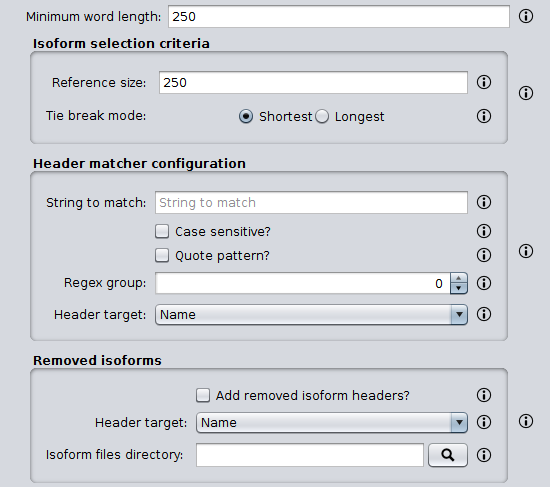

Examples
++++++++

The following example illustrates how isoforms in the input FASTA file are removed so that the output FASTA only contains those with a sequence length closest to a *Reference size* of *10*. The *Minimum word length* is *8*.

Input:

.. code-block:: console

 >S1 [Size 10]
 AAAAATTTTT
 >S2 [Size 8]
 AAAATTTT
 >S3 [Size 6]
 AAATTT
 >S4 [Size 12]
 TTTTTTGGGGGG
 >S5 [Size 10]
 TTTTTGGGGG

Output:

.. code-block:: console

 >S1 [Size 10]
 AAAAATTTTT
 >S3 [Size 6]
 AAATTT
 >S5 [Size 10]
 TTTTTGGGGG

As explained before, the *Header matcher configuration* allows to split the input sequences in groups that will be processed separately. This option is meant for those scenarios where sequences from two or more species are mixed in the same FASTA file and this operation should be applied to each species separately. Consider the input FASTA below that contains sequences from both *Homo sapiens* and *Mus musculus*. When it is processed using the configuration below, the output FASTA is obtained.

Note how the *Mus_musculus_3* sequence is present in the output file although, without knowing its origin it could have been considered an isoform of the *Homo_sapiens_1* sequence. This is because the regular expression *^[^_]*_[^_]** splits the sequences in two groups: those containing *Homo_sapiens* and those containing *Mus_musculus*, which are processed separately.

.. code-block:: console

 >Homo_sapiens_1 [Size 10]
 AAAAATTTTT
 >Homo_sapiens_2 [Size 8]
 AAAATTTT
 >Mus_musculus_1 [Size 12]
 TTTTTTGGGGGG
 >Mus_musculus_2 [Size 10]
 TTTTTGGGGG
 >Mus_musculus_3 [Size 12]
 AAAAAATTTTTT

Output:

.. code-block:: console

 >Homo_sapiens_1 [Size 10]
 AAAAATTTTT
 >Mus_musculus_2 [Size 10]
 TTTTTGGGGG
 >Mus_musculus_3 [Size 12]
 AAAAAATTTTTT

Remove redundant sequences
--------------------------

This operation allows removing redundant sequences. Redundant sequences are sequences with exactly the same sequence bases. If the *‘Remove also subsequences’* option is selected, then sequences contained within larger sequences are also removed.

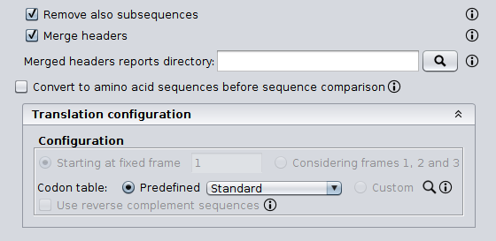

Option *‘Merge headers’* allows controlling how new sequences are created. If this option is not selected, then the header of the new sequence is the header of one of the two being merged. On the contrary, if this option is selected, the header of the new sequence is created by concatenating the headers of the two sequences being merged. You can also save a report of the merged headers into a file by selecting the *‘Save merged headers into a file’*.

When removing redundant sequences, it is also possible to indicate that the sequences must be converted to amino acid sequences before checking if they are redundant. This way, it is possible to filter nucleic acid sequences based on amino acid patterns. To do so, the *‘Convert to amino acid sequence before sequence comparison’* option should be enabled. Please note that nucleotide sequences containing ambiguity codes will not be translated generating an error. This option allows to configure the translation mode using the panel below.

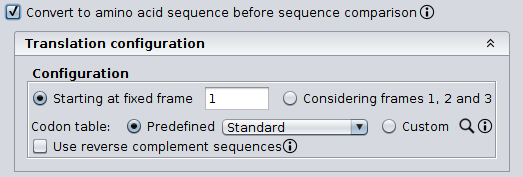

This panel allows to specify:

- The frame in which translation should start. You can choose between:

  - *Starting at fixed frame*: by selecting this option, sequences are translated starting at the specified frame.
  - *Considering frames 1, 2 and 3*: by selecting this option, three translations starting at frames 1, 2 and 3 are created. This way, each translation is tested separately and the sequence is considered redundant if any of the three frames is redundant.

- *Use a custom codon code*: this option allows selecting a file containing a custom DNA codon table. This option is unselected by default and in this case SEDA uses the standard genetic code. A custom codon code must be given in the following format:

.. code-block:: console

	TTT=T
	CTT=C
	GCA=A

- *Use reverse complement sequences*: whether reverse complement of sequences is used before translation or not. If not selected, sequences are used as they are introduced.

Examples
++++++++

The following example shows how only exact sequences are removed. Since *Sequence1* and *Sequence2* have the same nucleotide sequence, they are combined in the output FASTA. The *‘Merge headers’* is selected to illustrate how sequence headers are combined.

Input:

.. code-block:: console

 >Sequence1
 ATGGTCCATGGGTACAAAGGGGT
 >Sequence2
 ATGGTCCATGGGTACAAAGGGGT
 >Sequence3
 CCATGGGTACA

Output:

.. code-block:: console

 >Sequence1 [Sequence2]
 ATGGTCCATGGGTACAAAGGGGT
 >Sequence3
 CCATGGGTACA

The following example shows how both exact sequences and subsequences are removed. Since *Sequence1* and *Sequence2* have the same nucleotide sequence, they are combined in the output FASTA. *Sequence3* is also combined with the previous combination because CCATGGGTACA is contained in it.

Input:

.. code-block:: console

 >Sequence1
 ATGGTCCATGGGTACAAAGGGGT
 >Sequence2
 ATGGTCCATGGGTACAAAGGGGT
 >Sequence3
 CCATGGGTACA

Output:

.. code-block:: console

 >Sequence1 [Sequence2] [Sequence3]
 ATGGTCCATGGGTACAAAGGGGT

Gene Annotation
===============

ProSplign/ProCompart Pipeline
-----------------------------

This operation allows to obtain CDS annotations using the selected FASTA files as reference proteing sequences with ProSplign/ProCompart. This operation applies the procedure described here (https://www.ncbi.nlm.nih.gov/sutils/static/prosplign/prosplign.html) using each selected FASTA file as protein query.

ProSplign/ProCompart can be seen as an alternative to Splign/Compart. When using this operation, protein reference sequences rather than CDSs (nucleotide) reference sequences are used. Since protein sequences change at a slower pace than nucleotide sequences, in principle the reference and target sequences can be more distantly related than when using the Splign/Compart option, but it is difficult to quantify how distantly related they can be. Moreover, Splign/Compart runs considerably faster than ProSplign/ProCompart. The resulting CDS annotation is based on the homology to a given protein reference sequence, and thus may produce sequence annotations with lengths that are not multiple of three, if for instance, sequencing errors causing frameshifts are present in the genome to be annotated. Nevertheless, the existence of intron splicing signals at the exons 5’ and 3’ ends is taken into account. There will be no stop codon in the CDS annotation since the reference sequence is a protein.

Configuration
+++++++++++++

First, the *‘ProSplign/ProCompart configuration’* area allows to select the execution mode of ProSplign/ProCompart: *system binary* indicates that they will be executed directly using their binaries and *Docker image* means that a Docker image will be used instead.

In the *system binary* mode, the path where the required binaries (prosplign and procompart-wrapper) are located must be specified (refer to section :ref:`Dependencies<dependencies>` for additional information about this). If you have them in the system path, just click the *‘Check binary’* button to make sure that SEDA can correctly execute them.

In the *Docker image* mode, the default image is already set, although it is possible to choose a custom one provided that it has the ProSplign/ProCompart binaries in the system path.

Secondly, the *‘Blast configuration’* area allows to select the execution mode of Blast: *system binary* indicates that blast will be executed directly using its binaries and *Docker image* means that a Docker image will be used instead.

In the *system binary* mode, the path where the blast binaries (makeblastdb, blastdb_aliastool, blastdbcmd, blastp, blastn, blastx, tblastn, and tblastx) are located must be specified (refer to section :ref:`Dependencies<dependencies>` for additional information about this). If you have them in the system path, just click the *‘Check binary’* button to make sure that SEDA can correctly execute them.

In the *Docker image* mode, the default image is already set, although it is possible to choose a custom one provided that it has the blast binaries in the system path.

Finally, the configuration panel also allows to choose:

- *External file query*: the genome query file (nucleotides).
- *Max. target seqs.*: value of the *max_target_seqs* BLAST parameter.

Splign/Compart Pipeline
-----------------------

This operation allows to annotate exons or genes, as long as a CDS reference sequence is available from a closely related species. How closely related the species must be depends on how fast the gene(s) in question evolve. For instance, a few highly conserved Drosophila virilis genes can be annotated this way using as reference Drosophila melanogaster CDSs (the common ancestor of the two species lived more than 40 million years ago). Each selected FASTA file is used as query and an external genome must be provided in the operation configuration.

Configuration
+++++++++++++

First, the *‘Splign/Compart configuration’* area allows to select the execution mode of Splign/Compart: *system binary* indicates that they will be executed directly using their binaries and *Docker image* means that a Docker image will be used instead.

In the *system binary* mode, the path where the required binaries (splign and compart) are located must be specified (refer to section :ref:`Dependencies<dependencies>` for additional information about this). If you have them in the system path, just click the *‘Check binary’* button to make sure that SEDA can correctly execute them.

In the *Docker image* mode, the default image is already set, although it is possible to choose a custom one provided that it has the Splign/Compart binaries in the system path.

Secondly, the *‘Blast configuration’* area allows to select the execution mode of Blast: *system binary* indicates that blast will be executed directly using its binaries and *Docker image* means that a Docker image will be used instead.

In the *system binary* mode, the path where the blast binaries (makeblastdb, blastdb_aliastool, blastdbcmd, blastp, blastn, blastx, tblastn, and tblastx) are located must be specified (refer to section :ref:`Dependencies<dependencies>` for additional information about this). If you have them in the system path, just click the *‘Check binary’* button to make sure that SEDA can correctly execute them.

.. figure:: images/operations/splign-compart/2.png
   :align: center

In the *Docker image* mode, the default image is already set, although it is possible to choose a custom one provided that it has the blast binaries in the system path.

Thirdly, the *’bedtools configuration’* area allows to select the execution mode of bedtools: *system binary* indicates that bedtools will be executed directly using its binaries and *Docker image* means that a Docker image will be used instead.

In the *system binary* mode, the path where the bedtools binary is located must be specified (refer to section :ref:`Dependencies<dependencies>` for additional information about this). If you have them in the system path, just click the *‘Check binary’* button to make sure that SEDA can correctly execute it.

In the *Docker image* mode, the default image is already set, although it is possible to choose a custom one provided that it has the bedtools binary in the system path.

Finally, the configuration panel also allows to choose:

- *External file query*: the genome query file (nucleotides).
- *Concatenate exons?*: if this option is checked  then adjacent exons will be concatenated. Therefore, if an annotation is obtained for every exon of a given gene, the resulting sequence will be the complete CDS.

General
=======

Compare
-------

This operation allows to make all the possible pairwise comparisons on the input files.

The configuration panel allows to choose the *Sequence target*, which is the part of the sequences that must be used to compare them, and also the *Reformat output file* settings, which allows to specify the format parameters of the output FASTA files containing the comparison results (see section :ref:`Reformat file<operations-reformat-file>` to learn more about this formatting).

.. figure:: images/operations/compare/1.png
   :align: center

Examples
++++++++

The following example shows how the two input FASTA files are compared using the nucleotide sequence as *Sequence target*.

Input1:

.. code-block:: console

 >Sequence1
 ACTG
 >Sequence2
 TCGA
 >Sequence3
 TTAA
 >Sequence6
 AAAA

Input2:

.. code-block:: console

 >Sequence1
 ACTG
 >Sequence4
 GGTT
 >Sequence5
 GTCA
 >Sequence6
 AAAA

Input1_vs_Input2_both.fasta:

.. code-block:: console

 >Sequence1
 ACTG
 >Sequence6
 AAAA

Input1_vs_Input2_only_Input1.fasta

.. code-block:: console

 >Sequence2
 TCGA
 >Sequence3
 TTAA

Input1_vs_Input2_only_Input2.fasta

.. code-block:: console

 >Sequence4
 GGTT
 >Sequence5
 GTCA

Grow sequences
--------------

This operation allows to grow sequences by merging those sequences with the specified *‘Minimum overlapping’* bases.

This operation applies the following algorithm to merge sequences:

1.	Use the first sequence as reference sequence.
2.	Compare the reference sequence to the rest of sequences. For each pair of sequences, check if there is an overlapping of bases of at least the minimum size specified. This overlapping is searched at the beginning of the reference sequence and at the ending of the sequence being compared.

  a)	If an overlapping is found, merge the two sequences. The merged sequences are removed from the set of sequences and the new one is added. Return to step 1.
  b)	If an overlapping is not found between the first reference sequence and the rest of sequences, then step 2 is repeated for the rest of sequences repeatedly.

3.	The process stops when all sequences have been compared without merging any of them.

Examples
++++++++

The following example shows how sequences with a minimum overlapping of 6 in the input FASTA are merged. *Sequence1* and *Sequence2* have an overlapping region of 9 bases (*CTCTCTCTC*), thus they are merged in the output FASTA.

Input:

.. code-block:: console

 >Sequence1
 AAAAAGGCTCTCTCTC
 >Sequence2
 CTCTCTCTCGGGGGGG
 >Sequence3
 ACTGACTGAAAAA

Output:

.. code-block:: console

 >Sequence3
 ACTGACTGAAAAA
 >Sequence2 [Sequence1]
 AAAAAGGCTCTCTCTC
 GGGGGGG

The following example shows how sequences with a minimum overlapping of 4 in the input FASTA are merged. *Sequence1* and *Sequence3* have an overlapping region of 5 bases (*AAAAA*) in the highlighted area, thus they are merged in the first place. Then, the resulting sequence has an overlapping region of 8 bases with *Sequence2*, thus there is only one sequence in the output FASTA.

Input:

.. code-block:: console

 >Sequence1
 AAAAAGGCTCTCTCTC
 >Sequence2
 CTCTCTCTCGGGGGGG
 >Sequence3
 ACTGACTGAAAAA

Output:

.. code-block:: console

 >Sequence2 [Sequence1 [Sequence3]]
 ACTGACTGAAAAAGGCTCTCTCTCGGGGGGG

Merge
-----

This operation allows to merge all the selected input FASTA files into a single output FASTA. The *‘Name’* parameter defines the name for the output file. Additionally, you can specify the FASTA format parameters in the *‘Reformat output file’* area (see section :ref:`Reformat file<operations-reformat-file>` to learn more about this formatting).

The following example illustrates how input FASTA files 1 and 2 are merged into a single output FASTA file without line breaks.

Input 1:

.. code-block:: console

 >Homo_sapiens_1
 ACTG
 ACTG
 >Homo_sapiens_2
 ACTG
 ACTG

Input 2:

.. code-block:: console

 >Mus_musculus_1
 ACTG
 ACTG
 >Mus_musculus_2
 ACTG
 ACTG

Output:

.. code-block:: console

 >Homo_sapiens_1
 ACTGACTG
 >Homo_sapiens_2
 ACTGACTG
 >Mus_musculus_1
 ACTGACTG
 >Mus_musculus_2
 ACTGACTG

Regular expression split
------------------------

This operation allows to split each input FASTA file based on regular expression patterns. This operation matches the defined regular expression pattern against the sequence headers to make groups using the matching parts.

The configuration panel allows to set the parameters of the operation:

- *Group names files directory*: whether the groups created for each file should be saved into a TXT file or not. This allows an easy identification of the sequence groups that have been created. If you do not want to save them, leave this file empty. Otherwise choose the directory where such files should be created.
- *Header matcher configuration*: this option allows to specify how sequences must be grouped to form the new files.

	- *String to match*: the regular expression that must be matched in the sequence header.
	- *Case sensitive?*: whether the string must be matched as case sensitive or not.
	- *Quote pattern?*: whether the regular expression pattern must be quoted or not. When the regular expression is quoted, metacharacters or escape sequences in it will be given no special meaning.
	- *Regex group?*: the regular expression group that must be extracted. Default value is *0*, meaning that the entire result must be considered. Use values higher than 0 when there are brackets in the regular expression in order to select the desired group.
	- *Header target?*: the part of the sequence header where the string must be found.

Examples
++++++++

This is a powerful option that allows complex splits. For instance, it can be used in those scenarios where sequences from two or more species are mixed in the same FASTA file and one FASTA file per species is wanted. Consider the input FASTA below that contains sequences from three species: *Homo sapiens*, *Gallus gallus*, and *Mus musculus*. When it is processed using the configuration below, three output FASTA files are obtained. Basically, the regular expression *^[^_]*_[^_]** is able to extract the common species names from the headers so that sequences are grouped based in them.

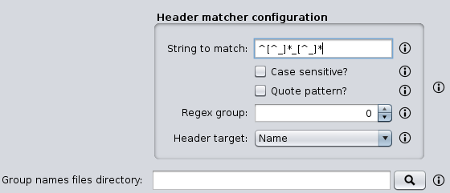

.. code-block:: console

 >Homo_sapiens_1
 AAAAATTTTT
 >Homo_sapiens_2
 AAAATTTT
 >Mus_musculus_1
 TTTTTTGGGGGG
 >Mus_musculus_2
 TTTTTGGGGG
 >Gallus_gallus_1
 AAAAAATTTTTT
 >Gallus_gallus_2
 TTTTTGGGGG

Output FASTA *Gallus_gallus*:

.. code-block:: console

 >Gallus_gallus_1
 AAAAAATTTTTT
 >Gallus_gallus_2
 TTTTTGGGGG

Output FASTA *Homo_sapiens*:

.. code-block:: console

 >Homo_sapiens_1
 AAAAATTTTT
 >Homo_sapiens_2
 AAAATTTT

Output FASTA *Mus_musculus*:

.. code-block:: console

 >Mus_musculus_1
 TTTTTTGGGGGG
 >Mus_musculus_2
 TTTTTGGGGG

In addition, if a folder is selected in the *Group names files directory* option, it is ceated the following file containing the list of matches obtained for this FASTA file:

.. code-block:: console

 Homo_sapiens
 Mus_musculus
 Gallus_gallus

Split
-----

This operation allows to split each input FASTA file into several FASTA files. The *‘Split mode’* parameter defines the way of splitting them:

- *Fixed number of sequences per file*: it divides each input FASTA into several files containing the defined *‘Number of sequences’* in each one.
- *Fixed number of files*: it divides each input FASTA into the defined *‘Number of files’* with the same number of sequences in each one.
- *Fixed number of sequences per defined number of files*: it divides each input FASTA into the defined *‘Number of files’* containing the defined *‘Number of sequences’* in each one. In this mode, the result of multiplying *‘Number of files’* by *‘Number of sequences’* should be less or equal to the number of sequences contained in the input FASTA file being processed. Nevertheless, in some occasions it may be necessary to do that. The option *‘Independent extractions’* allows doing this. See the examples section on how this option works.

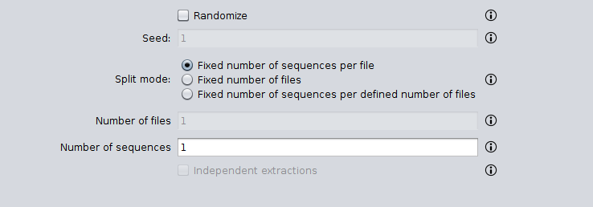

In addition, if the *‘Randomize’* option is selected, sequences in the input FASTA are sorted in a random order before producing the output FASTA files.

Examples
++++++++

Fixed number of sequences per file
^^^^^^^^^^^^^^^^^^^^^^^^^^^^^^^^^^

The following example shows how to split an input FASTA file containing 5 sequences into files containing 2 sequences. Three output FASTA are created: two containing the specified number of sequences (2 sequences) and one containing the remaining (1 sequence).

Input:

.. code-block:: console

 >Sequence1
 ACTG
 >Sequence2
 ACTGACTG
 >Sequence3
 ACTGACTGACTG
 >Sequence4
 ACTGACTGACTGACTG
 >Sequence5
 ACTGACTGACTGACTGACTG

Output 1:

.. code-block:: console

 >Sequence1
 ACTG
 >Sequence2
 ACTGACTG

Output 2:

.. code-block:: console

 >Sequence3
 ACTGACTGACTG
 >Sequence4
 ACTGACTGACTGACTG

Output 3:

.. code-block:: console

 >Sequence5
 ACTGACTGACTGACTGACTG

Fixed number of files
^^^^^^^^^^^^^^^^^^^^^

The following example shows how to split an input FASTA file containing 5 sequences into three files. Three output FASTA are created: two containing 2 sequences and one containing 1 sequence.

Input:

.. code-block:: console

 >Sequence1
 ACTG
 >Sequence2
 ACTGACTG
 >Sequence3
 ACTGACTGACTG
 >Sequence4
 ACTGACTGACTGACTG
 >Sequence5
 ACTGACTGACTGACTGACTG

Output 1:

.. code-block:: console

 >Sequence1
 ACTG
 >Sequence2
 ACTGACTG

Output 2:

.. code-block:: console

 >Sequence3
 ACTGACTGACTG
 >Sequence4
 ACTGACTGACTGACTG

Output 3:

.. code-block:: console

 >Sequence5
 ACTGACTGACTGACTGACTG

Fixed number of sequences per defined number of files
^^^^^^^^^^^^^^^^^^^^^^^^^^^^^^^^^^^^^^^^^^^^^^^^^^^^^

The following example shows how to split an input FASTA file with five sequences into three files containing one sequence.

Input:

.. code-block:: console

 >Sequence1
 ACTG
 >Sequence2
 ACTGACTG
 >Sequence3
 ACTGACTGACTG
 >Sequence4
 ACTGACTGACTGACTG
 >Sequence5
 ACTGACTGACTGACTGACTG

Output 1:

.. code-block:: console

 >Sequence1
 ACTG

Output 2:

.. code-block:: console

 >Sequence2
 ACTGACTG

Output 3:

.. code-block:: console

 >Sequence3
 ACTGACTGACTG

Note how input order is kept in the three output FASTA files that are created. If the *‘Randomize’* option is used, the following output with sequences in a random order can be obtained.

Output 1:

.. code-block:: console

 >Sequence2
 ACTGACTG

Output 2:

.. code-block:: console

 >Sequence5
 ACTGACTGACTGACTGACTG

Output 3:

.. code-block:: console

 >Sequence1
 ACTG

Finally, if you want to obtain three FASTA files with three sequences each you need to use the *‘Independent extractions’* option. This option is usually combined with the *‘Randomize’* option. By doing this, the following output could be obtained.

Output 1:

.. code-block:: console

 >Sequence2
 ACTGACTG
 >Sequence5
 ACTGACTGACTGACTGACTG
 >Sequence4
 ACTGACTGACTGACTG

Output 2:

.. code-block:: console

 >Sequence5
 ACTGACTGACTGACTGACTG
 >Sequence1
 ACTG
 >Sequence3
 ACTGACTGACTG

Output 3:

.. code-block:: console

 >Sequence1
 ACTG
 >Sequence4
 ACTGACTGACTGACTG
 >Sequence2
 ACTGACTG

Translate
---------

This operation allows to translate nucleic acid sequences to their corresponding peptide sequences. It can translate to the three forward and three reverse frames, and output multiple frame translations at once.

The configuration panel allows to specify:

- The frame in which translation should start. You can choose between:

  - *Starting at fixed frame*: by selecting this option, sequences are translated starting at the specified frame.
  - *Considering frames 1, 2 and 3*: by selecting this option, three translations starting at frames 1, 2 and 3 are created.

- *Use a custom codon code*: this option allows selecting a file containing a custom DNA codon table. This option is unselected by default and in this case SEDA uses the standard genetic code. A custom codon code must be given in the following format:

.. code-block:: console

	TTT=T
	CTT=C
	GCA=A

- *Use reverse complement sequences*: whether reverse complement of sequences must be calculated before translation or not. If not selected, sequences are used as they are introduced and therefore the three forward frames are obtained. If selected, the three reverse frames are obtained.

Examples
++++++++

The following example shows how sequences are translated in the three frames without using the reverse complement sequences. Note that stop codons are marked with an \*.

Input:

.. code-block:: console

 >Sequence1
 TTCCTTTGTCGCAGGGGG
 >Sequence2
 GGAGATGACCACTCG

Output_frame_1:

.. code-block:: console

 >Sequence1
 FLCRRG
 >Sequence2
 GDDHS

Output_frame_2:

.. code-block:: console

 >Sequence1
 SFVAG
 >Sequence2
 EMTT

Output_frame_3:

.. code-block:: console

 >Sequence1
 PLSQG
 >Sequence2
 R*PL

The following example shows how sequences are translated in the three frames using the reverse complement sequences.

Input:

.. code-block:: console

 >Sequence1
 TTCCTTTGTCGCAGGGGG
 >Sequence2
 GGAGATGACCACTCG

Output_frame_1:

.. code-block:: console

 >Sequence1
 PPATKE
 >Sequence2
 RVVIS

Output_frame_2:

.. code-block:: console

 >Sequence1
 PLRQR
 >Sequence2
 EWSS

Output_frame_3:

.. code-block:: console

 >Sequence1
 PCDKG
 >Sequence2
 SGHL

Reformatting
============

Disambiguate sequence names
---------------------------

This operation allows to disambiguate duplicated sequence names (identifiers). The configuration panel allows to choose the way of disambiguating them: *Rename*, to add a numeric prefix to disambiguate duplicate names, or *Remove*, to remove sequences with duplicate identifiers, keeping the first occurrence.

The following example shows how sequences with duplicate names in the input FASTA are removed (in the Removed Output FASTA) or renamed to avoid those redundancies (in the Rename Output FASTA).

Input:

.. code-block:: console

 >SequenceA
 ATGGTCCATG
 >SequenceA
 ATGGGCTAAC
 >SequenceB
 ATGGGGCCAC
 >SequenceB
 ATGGCCAACC
 >SequenceC
 CCCCTTTGGG

*Remove* Output:

.. code-block:: console

 >SequenceA
 ATGGTCCATG
 >SequenceB
 ATGGGGCCAC
 >SequenceC
 CCCCTTTGGG

*Rename* Output:

.. code-block:: console

 >SequenceA_1
 ATGGTCCATG
 >SequenceA_2
 ATGGGCTAAC
 >SequenceB_1
 ATGGGGCCAC
 >SequenceB_2
 ATGGCCAACC
 >SequenceC
 CCCCTTTGGG

NCBI rename
-----------

This operation allows to replace NCBI accession numbers in the names of FASTA files by the associated organism name and additional information from the NCBI Taxonomy Browser (https://www.ncbi.nlm.nih.gov/Taxonomy/). An example of a FASTA file could be ‘GCF_000001735.3_TAIR10_cds_from_genomic.fna’. When this file is given to this operation, the organism name associated to the accession number ‘GCF_000001735.3’ is obtained from the NCBI (https://www.ncbi.nlm.nih.gov/assembly/GCF_000001735.3). In this case, the ‘*Arabidopsis thaliana* (thale cress)’ is the associated organism name. The *‘File name’* allows specifying how this name is added to the file name and the *‘Delimiter’* parameter specifies if a separator should be set between the name and the file name. You can choose between one of the following *‘Position’* values:

- *Prefix*: before the actual file name. In the example, with ‘Delimiter’ = ‘_’, the output FASTA would be named ‘Arabidopsis thaliana (thale cress)_GCF_000001735.3_TAIR10_cds_from_genomic.fna’.
- *Suffix*: after the actual file name.  In the example, with ‘Delimiter’ = ‘_’, the output FASTA would be named ‘GCF_000001735.3_TAIR10_cds_from_genomic.fna_Arabidopsis thaliana (thale cress)’.
- *Override*: entirely replacing the actual file name. In the example, the output FASTA would be named ‘Arabidopsis thaliana (thale cress)’.
- *Replace*: replacing the accession number.  In the example, the output FASTA would be named ‘Arabidopsis thaliana (thale cress)_TAIR10_cds_from_genomic.fna’.
- *None*: not modifying the file name.

In addition to modifying the name of the FASTA files, this operation can also add this information to the sequence headers. This is configured in the *‘Sequence headers’* area shown below. This option does the same than the *‘Add prefix/suffix‘* rename mode of the *Rename header* operation (see section :ref:`Add prefix/suffix<operations-rename-header-add>`), being the organism name the string to add to the sequence headers.

Moreover, some general configuration parameters can be specified in the *‘Configuration’* area. These parameters are:

- *Replace blank spaces*: whether blank spaces must be replaced or not.
- *Replace special characters*: whether special characters must be replaced or not. Special characters are ‘<‘, ‘>‘, ‘:‘, ‘\‘, ‘/‘, ‘\|‘, ‘?‘, and ‘\*‘.
- *Replacement*: the replacement string for those special characters.
- *Save replacements map*: whether the replacements map must be saved or not. This is useful to know how accession numbers have been replaced.
- *File*: the file to save the replacements map.

Finally, this operation also allows obtaining additional information from the NCBI Taxonomy. The *‘NCBI Taxonomy information’* panel allows choosing what fields should be added to the organism name when applying the operation. Fields are added with the *‘Delimiter’* as separator. For instance, the accession number ‘GCF_000001735.3’ has this information page: https://www.ncbi.nlm.nih.gov/Taxonomy/Browser/wwwtax.cgi?mode=Info&id=3702. If you select *‘Kingdom’*, then the string associated to it would be ‘*Arabidopsis thaliana* (thale cress)_Viridiplantae’. Note that some accession numbers or organisms may not have available information for all fields. In that case, those fields are ignored.

Reallocate reference sequences
------------------------------

This operation allows to find one or more sequences (i.e. your reference sequences) using a pattern filtering option and reallocate them at the beginning of the file. For instance, this operation is useful to place at the beginning of your FASTA files the reference sequence or sequences and specify them in the *‘Remove by size difference’* filtering operation.

.. figure:: images/operations/reallocate-reference-sequences/1.png
   :align: center

The configuration of this operation is the same as the *Pattern filtering* configuration. Thus, you may refer to :ref:`Pattern filtering<operations-pattern-filtering>` section to learn how to use it.

Examples
++++++++

The following example shows how an input FASTA file is processed to reallocate those sequences containing *ACTG* at the beginning of the file.

Input:

.. code-block:: console

 >Sequence1
 AGGGTTTAGCCAACGCCTGCAGCA
 >Sequence2
 AGGGTTTAGCCAACTGCTGCAGCA
 >Sequence3
 CTACTGGAATAGAACCTCTGGAAT
 >Sequence4
 CTATGGAATAGAACCTCTGGAATC

Output:

.. code-block:: console

 >Sequence2
 AGGGTTTAGCCAACTGCTGCAGCA
 >Sequence3
 CTACTGGAATAGAACCTCTGGAAT
 >Sequence1
 AGGGTTTAGCCAACGCCTGCAGCA
 >Sequence4
 CTATGGAATAGAACCTCTGGAATC

The following example shows how an input FASTA is processed to reallocate those sequences containing *Homo_Sapiens* in their headers at the beginning of the file.

Input:

.. code-block:: console

 >Mus_musculus
 TGCCAGAGAACTGCCGGTGTGGTG
 >Pan_paniscus
 ATGTCTTCCATTAAGATTGAGTGT
 >Homo_sapiens
 GCACCAGGGGGCCCTGTACTCCCT
 >Falco_cherrug
 CGCGCAGCCGTCTTTGACCTTGAT

Output:

.. code-block:: console

 >Homo_sapiens
 GCACCAGGGGGCCCTGTACTCCCT
 >Mus_musculus
 TGCCAGAGAACTGCCGGTGTGGTG
 >Pan_paniscus
 ATGTCTTCCATTAAGATTGAGTGT
 >Falco_cherrug
 CGCGCAGCCGTCTTTGACCTTGAT

Reformat file
-------------

This operation allows to change the format of a FASTA file. This format includes:

- *Fragment length*: the fragment length or number of columns in which sequences are divided. The *’Remove line breaks’* option specifies that sequences should not be fragmented.
- *Line breaks*: the type of line breaks, which can be *‘Windows‘* or *‘Unix‘*.
- *Case*: the case of the sequences. *‘Original‘* means that original case in input sequences is kept and *‘Lower case’* and *‘Upper case’* allows converting sequences to lower or upper case bases respectively.

Examples
++++++++

The following example illustrates how line breaks are removed from the input FASTA sequences by using this operation with the *‘Remove line breaks’* option selected.

Input:

.. code-block:: console

 >Sequence1
 ACTG
 ACTG
 AC
 >Sequence2
 ACTGACTG
 ACTGA

Output:

.. code-block:: console

 >Sequence1
 ACTGACTGAC
 >Sequence2
 ACTGACTGACTGA

The following example illustrates how the length of the input FASTA sequences is set to 4.

Input:

.. code-block:: console

 >Sequence1
 ACTGACTGAC
 >Sequence2
 ACTGACTGACTGA

Output:

.. code-block:: console

 >Sequence1
 ACTG
 ACTG
 AC
 >Sequence2
 ACTG
 ACTG
 ACTG
 A

Rename header
-------------

This operation allows to modify the sequence headers in different ways. These ways are specified in the *‘Rename type’* parameter, which allows choosing between: *Multipart header*, *Replace word*, *Replace interval* and *Add prefix/suffix*. Each of these methods is explained below.

Common to all these methods is the *‘Target’* parameter, which allows to specify which part of the sequence headers must be processed: *Name*, to process only the sequence identifier; *Description*, to process only the description part of the header; or *All*, to process both name and description together.

.. figure:: images/operations/rename-header/1.png
   :align: center

If a file selection has been done, the *‘Rename preview’* area shows you a preview of the current configuration applied to the first sequence of the first selected file.

Multipart header
++++++++++++++++

The *‘Multipart header’* rename allows to split the sequence header into fields delimited by the characters specified in the *‘Field delimiter’* parameter. Then, you can select which fields you want to keep or remove and which delimiter (*‘Join delimiter’* parameter) should be used to create the new sequence header. Note that when the *‘Keep‘* mode is used, then the order of the fields is preserved in the output, meaning that it is possible to swap fields using this feature.

As an example, consider that you have a set of sequences that have the following header structure:

.. code-block:: console

 >SequenceIdentifier [field1=value] [field2=value] [field3=value] [field4=value]

As you can see, fields are separated by a blank space. Thus, this rename mode is useful to remove those fields you are not interested in. The following example shows how only *field4* is kept in the output fasta. The configuration applied to do this should be: *‘Target’* = *‘Description’*, *‘Field delimiter’* = *‘ ‘*, *‘Join delimiter’* = *‘ ‘*, *‘Mode’* = *‘Keep’*, *‘Fields’* = *‘4’*.

Input:

.. code-block:: console

 >Sequence1 [field1=1.1] [field2=1.2] [field3=1.3] [field4=1.4]
 ACTG
 >Sequence2 [field1=2.1] [field2=2.2] [field3=2.3] [field4=2.4]
 ACTG
 >Sequence3 [field1=3.1] [field2=3.2] [field3=3.3] [field4=3.4]
 ACTG

Output:

.. code-block:: console

 >Sequence1 [field4=1.4]
 ACTG
 >Sequence2 [field4=2.4]
 ACTG
 >Sequence3 [field4=3.4]
 ACTG

Replace word
++++++++++++

The *‘Replace word’* rename mode allows to replace one or more words (*‘Targets’* parameter) by a *‘Replacement’* word. Moreover the *‘Regex’* parameter allows to specify whether target words should be evaluated as regular expressions or not (see section :ref:`Regular expressions<advanced-regex>` to know how to define regular expressions).

As an example, consider that you have a set of sequences that have the following header structure:

.. code-block:: console

 >SequenceIdentifier [gen=value] [protein=value]

As you can see, there are two description fields providing information about gene and protein. Thus, this rename mode is useful to remove those words and keep only the actual information values. The following example illustrates this process. The configuration applied to do this should be: *‘Targets’* = [*‘[gen=’, ‘[protein=’*, *‘]’* ], *‘Regex’* = *‘not selected‘*, *‘Replacement’* = *‘’*.

Input:

.. code-block:: console

 >Sequence1 [gen=genA] [protein=proteinA.1]
 ACTG
 >Sequence2 [gen=genB] [protein=proteinB.2]
 ACTG
 >Sequence3 [gen=genC] [protein=proteinC.3]
 ACTG

Output:

.. code-block:: console

 >Sequence1 genA proteinA.1
 ACTG
 >Sequence2 genB proteinB.2
 ACTG
 >Sequence3 genC proteinC.3
 ACTG

Replace interval
++++++++++++++++

The *‘Replace interval’* rename mode allows to replace an interval delimited by two words (*‘From’* and *‘to’*) by a *‘Replacement’* word.

As an example, consider that you have a set of sequences that have the following header structure:

.. code-block:: console

 >SequenceIdentifier [gen=value] / some automatically generated information / [protein=value]

As you can see, there are two description fields providing information about gene and protein and some information delimited by *‘/’*. Thus, this rename mode is useful to remove this interval. The following example illustrates this process. The configuration applied to do this should be: *‘From’* = *‘ / ’*, *‘To’* = *‘‘ / ’*, *‘Replacement’* = *‘[DELETED]’*.

Input:

.. code-block:: console

 >Sequence1 [gen=genA] / some automatically generated information / [protein=proteinA.1]
 ACTG
 >Sequence2 [gen=genB] / some automatically generated information / [protein=proteinB.2]
 ACTG
 >Sequence3 [gen=genC] / some automatically generated information / [protein=proteinC.3]
 ACTG

Output:

.. code-block:: console

 >Sequence1 [gen=genA] [DELETED] [protein=proteinA.1]
 ACTG
 >Sequence2 [gen=genB] [DELETED] [protein=proteinB.2]
 ACTG
 >Sequence3 [gen=genC] [DELETED] [protein=proteinC.3]
 ACTG

.. _operations-rename-header-add:

Add prefix/suffix
+++++++++++++++++

The *‘Add prefix/suffix’* rename mode allows to add the word specified in the *‘String’* parameter to the sequence headers. This word can be added in three positions (*‘Position’* parameter): *Prefix*, that is, before the part of the header to modify; *Suffix*, that is, after the part of the header to modify; or *Override*, that is, entirely replacing the part of the header to modify. This mode has the following additional parameters:

- *Delimiter*: the delimiter between the word to add and the header. Note that the word to add also includes the index.
- *Add index*: whether an index should be added to the defined word or not.
- *Index delimiter*: the delimiter between the word to add and the index number.

As an example, consider that you are interested in adding the word ‘Sequence’ delimited by a ‘_’ with an index delimited by a ‘_’. The resulting word can be added as prefix, suffix or overriding the entire header. For the sake of simplicity, input sequences do not contain a description in their headers.

Input:

.. code-block:: console

 >Homo_Sapiens_NP.00097
 ACTG
 >Homo_Sapiens_NP.00198
 ACTG
 >Homo_Sapiens_NP.02004
 ACTG

Output (*Prefix*):

.. code-block:: console

 >Sequence_1_Homo_Sapiens_NP.00097
 ACTG
 >Sequence_2_Homo_Sapiens_NP.00198
 ACTG
 >Sequence_3_Homo_Sapiens_NP.02004
 ACTG

Output (*Suffix*):

.. code-block:: console

 >Homo_Sapiens_NP.00097_Sequence_1
 ACTG
 >Homo_Sapiens_NP.00198_Sequence_2
 ACTG
 >Homo_Sapiens_NP.02004_Sequence_3
 ACTG

Output (*Override*):

.. code-block:: console

 >Sequence_1
 ACTG
 >Sequence_2
 ACTG
 >Sequence_3
 ACTG

.. _operations-reformat-file:

Sort
----

This operation allows to sort sequences. Sort can be made based on sequence headers or on the content of the sequences. You can choose between two criteria to sort them: length or alphabetical. By default, sequences are sorted in ascending order (e.g. the shortest sequence in the first place). The *‘Descending’* option allows to sort sequences in descending order (e.g. the longest sequence in the first place).

Examples
++++++++

The following example shows an input FASTA file sorted by sequence length (i.e. number of bases) in descending order.

Input:

.. code-block:: console

 >Sequence1
 ACTGACTGAC
 >Sequence2
 ACTGACTGACTGA
 >Sequence3
 ACTG
 >Sequence4
 ACTGACTGACTGACTG

Output:

.. code-block:: console

 >Sequence4
 ACTGACTGACTGACTG
 >Sequence2
 ACTGACTGACTGA
 >Sequence1
 ACTGACTGAC
 >Sequence3
 ACTG
