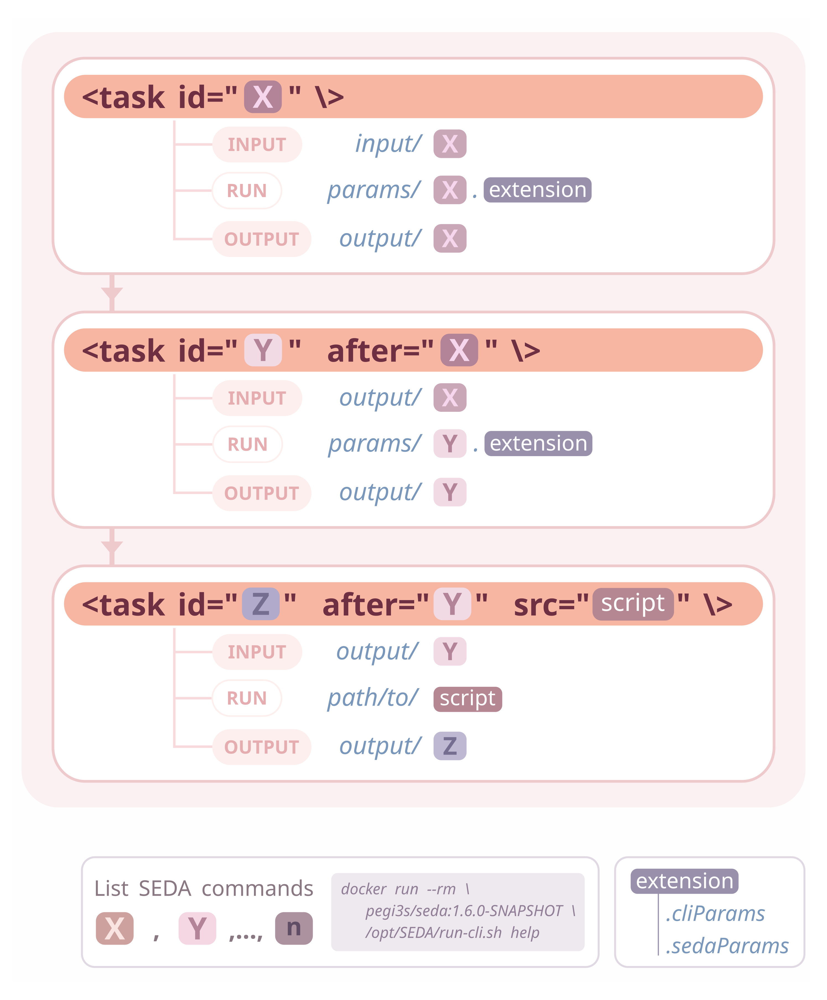

Pipelines
*********

The SEDA pipelines with Compi (https://github.com/sing-group/seda-compi-pipelines) project provides a framework for easily creating pipelines made up of SEDA commands using Compi (https://www.sing-group.org/compi/).

Compi pipelines are defined in an XML file that contains the pipeline parameters, task definitions and task dependencies. In a pipeline made up of SEDA commands all tasks would be essentially the same: running the specific SEDA command with a set of parameters over a set of input files; then, the input of each command would be the output of of its predecessor commands. As the SEDA CLI can read command parameters, this execution can be generalized so that pipeline developers should only declare the pipeline tasks (i.e. the SEDA CLI commands) and their execution order.

This is what this framework provides: a generic execution engine for Compi-based pipelines that only requires developers to follow some conventions regarding input, output and parameter files. The image below illustrates these conventions, which are further explained before.

Take a look at the project documentation (https://github.com/sing-group/seda-compi-pipelines) for a comprehensive description of the framework and some examples.

Note that the SEDA protocols presented are also available as SEDA-Compi pipelines:

- Preparing datasets for large scale phylogenetic analyses (https://github.com/pegi3s/seda-pipeline-phylogenetics-datasets)
- Protocol for a phylogenomics study (https://github.com/pegi3s/seda-pipeline-phylogenomics-study)
- Obtaining protein family members (https://github.com/pegi3s/seda-pipeline-protein-family-members)
