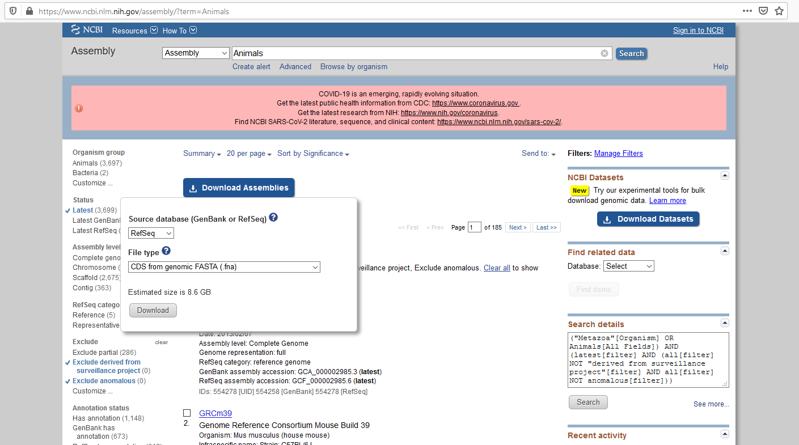

Protocols
*********

This section provides SEDA protocols with step-by-step execution guides.

Preparing datasets for large scale phylogenetic analyses
========================================================

This protocol shows how to retrieve and process a large amount of coding sequences of a given gene. The portrayed example concerns *GULO*, a gene that encodes for the protein that catalyzes the final oxidation step of the Vitamin C biosynthetic pathway in animals (http://doi.org/10.7554/eLife.06369).

Step 1: Download input data
---------------------------

The input data for this protocol can be obtained at https://www.ncbi.nlm.nih.gov/assembly/, by querying *Animals* on the search field, selecting *Download Assemblies*, and choosing the *CDS from genomic FASTA (.fna)* file type for both RefSeq and GenBank source databases. Please note that to obtain the maximum amount of information it is recommended to use both databases, since the data for each species does not completely overlap between them.

The download options are represented in the image below.

The parameter configuration files to configure the SEDA operations are available here: https://www.sing-group.org/seda/downloads/data/protocol-large-scale-phylogenetic-analysis.zip

Step 2: Checking for genome contaminants
----------------------------------------

After downloading the data and extracting all the FASTA files for both databases, click the *Edit selection* button of the SEDA GUI to load the input FASTA files. Due to the high number of files (544 for RefSeq and 671 for GenBank, obtained at 27/07/2020), less capable hardware can strugle to perform large scale operations using the available RAM. In these cases, the datasets can either be processed in adequate batches (e.g. 30 files at a time) or by switching to in-disk processing (which can be a very time consuming alternative).

.. Note::
   Note that the RefSeq and GenBank datasets must be processed separately in the initial protocol steps (up to step 6, they are merged in step 7), due to distinct file characteristics.

Next, select the *NCBI Rename* operation. To perform the operation, the *File Name* should have the *Prefix* position selected, as well as *_* as *Delimiter*. The *Sequence Headers* should have the *None* position option selected. As for *Configuration*, the *Replace blank spaces* and *Replace special characters* fields should be checked, and *_* selected as *Replacement*. The *NCBI Taxonomy information* parameter should have the *Delimiter* defined as *_* and *Kingdom* as the selected field.

The image below shows the operation configuration, which can be introduced manually or loaded from the *configuration/GenBank_RefSeq_Rename_header_1* file.

Once the operation is configured, choose an appropriate output directory for the files of both databases (e.g. *output/GenBank/1_NCBI_Rename*) and run the operation. When finished, check the output folder for genomes that do not contain the *Metazoa* tag. In this case, two (GCF_001297725.1 and GCF_002188315.1) and one (GCA_002188315.1) *E. coli* genomes were removed from the RefSeq and GenBank datasets, respectively. After this verification, clear the current file selection and load the filtered output files.

Step 3: tblastn analysis
------------------------

This step will be performed using the *BLAST* operation. In this example, the operation had a *System binary* execution mode selected. For this mode, it is necessary to have the BLAST binary files available in the computer, and as such the compatible operating system files (e.g. ncbi-blast-2.10.1+-x64-win64.tar.gz for Windows) should be previously downloaded from ftp://ftp.ncbi.nlm.nih.gov/blast/executables/blast+/LATEST/.

.. Note::
   Alternatively, BLAST can be executed using the *Docker image* execution mode. For this, only Docker must be installed in the computer where SEDA is running.

After extracting the content of the tar.gz file, the *bin* folder will be available for selection within the SEDA GUI at the *BLAST executables directory* field. The *DB Configuration section* can be left unaltered, and the *Query configuration* should have the *Each database separately* option selected, as well as *tblastn* as BLAST type. The external query file is the *Mus musculus* GULO protein (NP_848862.1), obtained in FASTA format from https://www.ncbi.nlm.nih.gov/protein/NP_848862.1?report=fasta. The remaining parameters are not altered in this protocol.

The image below shows the operation configuration, which can be introduced manually or loaded from the *configuration/BLAST* file (in this case, the *BLAST executables directory* and *External file query* paths must be adjusted).

Once the operation is configured, choose an appropriate output directory for the files of both databases (e.g. *output/GenBank/2_Blast_Results*) and run the operation. When finished, clear the current file selection and load the output files.

Step 4: Add taxonomic information to sequence headers
-----------------------------------------------------

Adding taxonomic information to sequence headers can be very usefull when analysing phylogenetic data. The *NCBI Rename* operation will again be required to achieve this purpose. Keep in mind that although this operation could be perfomed at the begining of the protocol, it is less time consuming when used after the *tblastn* operation, since many of the sequences were filtered and the output files are remarkably smaller and easier to process. As such, this step likely will not require the use of batches even when using less capable hardware. Furthermore, the selection of *Each database separately* for the previous BLAST operation is essencial, since the NCBI rename depends on the GCF or GCA numbers that would be lost by merging the individual outputs into a single file. To perform the operation, the *File Name* should have the *Override* position selected, as well as *_* as *Delimiter*. The *Sequence Headers* should have the *Prefix* position option selected and a *_* as *Delimiter*. As for *Configuration*, the *Replace blank spaces* and *Replace special characters* fields should be checked, and *_* selected as *Replacement*. Finally, the *NCBI Taxonomy information* parameter should have the *Delimiter* defined as *_* and *Class* and *Family* (in that order) as the selected fields.

The image below shows the operation configuration, which can be introduced manually or loaded from the *configuration/NCBI_Rename_2* file.

Once the operation is configured, choose an appropriate output directory for the files of both databases (e.g. *output/GenBank/3_NCBI_Rename_2*) and run the operation. When finished, clear the current file selection and load the output files.

Step 5: Merging the files for each database
-------------------------------------------

The output of the second *NCBI Rename* operation can be merged into a single file for each database (RefSeq and GenBank) to allow for the easy manipulation of the subsequent dataset outputs obtained. Using the *Merge* operation, select an appropriate name for the merged file in the *Name* field (e.g. GenBank_GULO), as well as the *Remove line breaks* option.

The image below shows the operation configuration, which can be introduced manually or loaded from the *configuration/All_Merge* file.

Once the operation is configured, choose an appropriate output directory for the files of both databases (e.g. *output/GenBank/4_Merged*) and run the operation. When finished, clear the current file selection and load the output files.

Step 6: Reformatting sequence headers
-------------------------------------

The unnecessary fields present in the sequence headers (which originate very long names), need to be reformatted in order to have an efficient and clean dataset for further analyses. Due to distinct characteristics of the RefSeq and GenBank sequence headers, their processing needs to be independent, thus avoiding the removal of crucial information. In this example, the sequence header reformatting will have three steps: the first and the third common between the RefSeq and GenBank files, and the second specific for each dataset.

6.1 First *Rename header*
+++++++++++++++++++++++++

Choosing the *Rename header* operation, select the *Rename type* as *Replace interval*, and place in the *From* and *To* fields the *[* and *]* characters, respectively. This can be applied to RefSeq and GenBank sequence headers.

The image below shows the operation configuration, which can be introduced manually or loaded from the *configuration/GenBank_RefSeq_Rename_header_1* file.

Once the operation is configured, choose an appropriate output directory for the files of both databases (e.g. *output/GenBank/5_Reformat_header*) and run the operation. When finished, clear the current file selection and load the output files.

6.2 Second *Rename header*
++++++++++++++++++++++++++

For the GenBank dataset, switch *Rename type* from *Replace interval* to *Replace word*, and check the *Regex* option. After, insert as *Element* the pattern *'ae_\\w+.[1-9]_cds'* and *'ae'* as replacement.

The image below shows the operation configuration, which can be introduced manually or loaded from the *configuration/GenBank_Rename_header_2* file.

Once the operation is configured, choose an appropriate output directory (e.g. *output/GenBank/5_Reformat_header/Second_step*) and run the operation. When finished, clear the current file selection and load the output file.

For the RefSeq dataset, keep the *Rename type* as *Replace interval*, and place in the *From* and *To* fields the *_N* and *_cds* characters, respectively.

The image below shows the operation configuration, which can be introduced manually or loaded from the *configuration/RefSeq_Rename_header_2* file.

Once the operation is configured, choose an appropriate output directory (e.g. *output/RefSeq/5_Reformat_header/Second_step*) and run the operation. When finished, clear the current file selection and load the output file.

6.3 Third *Rename header*
+++++++++++++++++++++++++

This step can be applied to RefSeq and GenBank sequence headers. Using the *Replace word* rename type, and checking the *Regex* option, insert as *Element* the pattern *'_[0-9]+$'*.

The image below shows the operation configuration, which can be introduced manually or loaded from the *configuration/GenBank_RefSeq_Rename_Header_3* file.

Once the operation is configured, choose an appropriate output directory (e.g. *output/GenBank/5_Reformat_header/Third_step*) and run the operation. When finished, clear the current file selection and load the output files.

Step 7: Merging GenBank and RefSeq files
----------------------------------------

Since the GenBank and RefSeq files are now reformated to have a compatible sequence header format with all the relevant information, they can be merged to a single file to facilitate the subsequent protocol. Using the *Merge* operation, select an appropriate name for the merged file in the *Name* field (e.g. Animals_GULO), as well as the *Remove line breaks* option.

The image below shows the operation configuration, which can be introduced manually or loaded from the *configuration/All_Merge* file.

Once the operation is configured, choose an appropriate output directory (e.g. *output/6_GULO_Merged*) and run the operation. When finished, clear the current file selection and load the output file.

Step 8: Remove sequences with ambiguous nucleotides
---------------------------------------------------

Sequences with ambiguous nucleotides do not allow for a correct DNA to protein sequence translation, and as such, should be removed from the dataset. To achieve this, select the *Pattern filtering* operation, choose the *Not contains* option on the *Patterns group* menu, and use the pattern *'[NVHDBMKWSYR]'* as query.

The image below shows the operation configuration, which can be introduced manually or loaded from the *configuration/Pattern_Filtering_1* file.

Once the operation is configured, choose an appropriate output directory (e.g. *output/7_Without_N*) and run the operation. When finished, clear the current file selection and load the output file.

Step 9: Search for the typical GULO Pattern
-------------------------------------------

GULO belongs to the vanillyl-alcohol oxidase (VAO) flavoproteins family, and as such, it is known to share a conserved HWXK amino acid motif with the remaining members (http://doi.org/10.1016/j.plaphy.2015.11.017). This evidence allows the restriction of the dataset to sequences that contain this translated motif, improving the quality of future molecular evolution analysis regarding the gene of interest.

To apply this filter, still in the *Pattern filtering* operation, check the *Convert to amino acid sequence before pattern matching* option on the *Patterns group* menu, choosing as configuration *Starting at fixed frame 1*. Then, select the *Contains* option and insert the pattern *'HW.{1}K'* as query.

The image below shows the operation configuration, which can be introduced manually or loaded from the *configuration/Pattern_Filtering_2* file.

Once the operation is configured, choose an appropriate output directory (e.g. *output/8_GULO_Pattern*) and run the operation. When finished, clear the current file selection and load the output file.

Step 10: Remove redundant sequences
-----------------------------------

To gather the maximum information possible, the use of the GenBank and RefSeq datasets was essential. Nevertheless, the use of both databases also implies the presence of many redundant sequences in the merged dataset. To avoid this issue, it is necessary to remove the redundant sequence representatives.

To achieve this, select the *Remove redundant sequences* operation, check the *Remove also subsequences* and *Save merged headers into a file* options and select an appropriate *Merge list directory* (e.g. *output/9_No_Duplicates/Merge_list*). This list may be important when, for example, there is a need to verify which sequences were removed and if they belong to distinct species by chance.

The image below shows the operation configuration, which can be introduced manually or loaded from the *configuration/Remove_Redundant_sequences* file.

Once the operation is configured, choose an appropriate output directory (e.g. *output/9_No_Duplicates*) and run the operation. When finished, clear the current file selection and load the output file.

Step 11: Sequence filtering
---------------------------

Although the sequences used in this protocol are tagged as coding in the download interface, it is not uncommon to find some without a valid start codon (ATG), with in-frame stop codons, or non-multiple of three. These sequences are likely derived from errors in annotation and should not be considered in further analyses.

To remove these sequences, select the *Filtering* operation and check *ATG* as the only valid start codon, as well as the *Remove sequences with a non-multiple of three length* and *Remove sequences with in-frame stop codons* options.

The image below shows the operation configuration, which can be introduced manually or loaded from the *configuration/Filtering_1* file.

Once the operation is configured, choose an appropriate output directory (e.g. *output/10_ATG_NO_STOP*) and run the operation. When finished, clear the current file selection and load the output file.

Step 12: Reallocate reference sequence and size difference filtering
--------------------------------------------------------------------

Sequences with a remarkable size difference relative to a given reference are sometimes derived from errors in annotation at intron/exon borders, and as such should be removed from further analyses. These sequences can be removed using two complementary operations in succession.

First, select the *Reallocate reference sequences* operation, and choose *Header* as the target. Given that the *Rattus norvegicus* sequence (EDL85374.1) has the same reference size as the *Mus musculus* sequence used as query in the *BLAST* operation, insert *'Rattus_norvegicus'* as the query pattern.

The image below shows the operation configuration, which can be introduced manually or loaded from the *configuration/Reallocate_Reference_Sequence* file.

Once the operation is configured, choose an appropriate output directory (e.g. *output/11_Realocated_Header*) and run the operation. When finished, clear the current file selection and load the output file.

After, process the *Reallocate reference sequences* output using the *Filtering* operation, checking the *Remove by sequence length difference* and allowing for a *Maximum length difference (%)* of 10% relative to the *Reference sequence index* 1 (*Rattus norvegicus* EDL85374.1).

The image below shows the operation configuration, which can be introduced manually or loaded from the *configuration/Filtering_2* file.

Once the operation is configured, choose an appropriate output directory (e.g. *output/12_Size_Difference*) and run the operation. When finished, clear the current file selection and load the output file.

Step 13: Remove isoforms
------------------------

Finally, to avoid the phylogenetic analysis of sequences that provide redundant information, it is important to remove any isoforms that may have resisted the various processing steps.

This refinement can be performed using the *Remove isoforms* operation. As parameters, keep the standard 250 *Minimum word length*, insert 440 as the reference size with *Longest* selected as tie break. Additionally, use *^[^_]*_[^_]** as string to match and *Name* as the header target. This configuration will consider only the sequences that share the first two header fields (species name) as possible isoform candidates. As for the *Removed isoforms* menu, select *Name* as the header target and choose an adequate *Isoform files directory* (e.g. *output/13_Remove_isoforms/Isoform_list*). Similarly to the redundant sequence list mentioned above, this list may be important to verify if any sequence of interest may have been mistakenly removed.

The image below shows the operation configuration, which can be introduced manually or loaded from the *configuration/Remove_Isoforms* file (in this case, the *Isoform files directory* path must be adjusted).

Once the operation is configured, choose an appropriate output directory (e.g. *output/13_Remove_Isoforms*) and run the operation. When finished, use this final output for further analysis.

Obtaining protein family members
================================

This protocol shows how to retrieve all members of a given protein family such as, for instance, mucins. The main feature of mucin proteins is their extended region of tandemly repeated sequences (PTS repeats), which contain prolines (P) together with serines (S), and/or threonines (T), which generally occupy between 30% and 90% of the protein length, and that cannot be detected in homology searches due to their poor sequence conservation (https://doi.org/10.1371/journal.pone.0003041). Mucins also show signal peptides and other associated domains.

Step 1: Download input data
---------------------------

The input data for this protocol is available here: https://www.sing-group.org/seda/downloads/data/protocol-mucin.zip This zip file also contains the parameter configuration files to configure the SEDA operations.

As the image below illustrates, the two input FASTA files for *Homo sapiens* (https://www.ncbi.nlm.nih.gov/assembly/GCF_000001405.39) and *Drosophila melanogaster* (https://www.ncbi.nlm.nih.gov/assembly/GCF_000001215.4) were downloaded from the NCBI assembly RefSeq database by selecting the *Download assembly / Protein FASTA (.faa)* option.

.. figure:: images/protocols/pfamscan/1.png
   :align: center

Step 2: Select the input FASTA files in SEDA
--------------------------------------------

After downloading the data, click the *Edit selection* button of the SEDA GUI to load the two input FASTA files as the image below shows.

.. figure:: images/protocols/pfamscan/2.png
   :align: center

Step 3: Sequence filtering
--------------------------

Select sequences containing the words *mucin* or *mucin-* in their headers, using the *Pattern filtering* operation (*Filtering* group), and the *' mucin[ -]'* regular expression (please, note the blank space before mucin). The execution time of this operation is less than 1 second.

The image below shows the operation configuration, which can be introduced manually or loaded from the *configuration/Step_1_Pattern_Filtering* file.

Once the operation is configured, choose an appropriate output directory (e.g. *output/Step_1_Pattern_Filtering*) and run the operation. When finished, clear the current file selection and load these two output files.

Step 4: Annotate sequences
--------------------------

Annotate sequences using the *PfamScan* operation (*Protein Annotation* group). It takes about 6 minutes to annotate 101 protein sequences when using a delay between batch submissions that is twice the time needed to process the first batch of 30 sequences (*Batch delay factor*).

The image below shows the operation configuration, which can be introduced manually or loaded from the *configuration/Step_2_PfamScan* file (in this case, remember to set a valid e-mail account).

Once the operation is configured, choose an appropriate output directory (e.g. *output/Step_2_PfamScan*) and run the operation. When finished, clear the current file selection and load these two output files.

Step 5: Extract the sequence headers
------------------------------------

Finally, with the annotated sequence files loaded in SEDA, extract the sequence headers. To do so, click the *Statistics* button to display the list of selected files.

Then, do right click on top of each file to see the sequence details and save this table, containing the protein families, into a CSV file using the *Export to CSV* button of the table.

When exporting this table into a CSV file, it is recommended to choose a custom format with the *Quote fields* option selected to guarantee that the file can be imported properly on a spreadsheet processing software.

Alternatively, it is possible to select the table contents with *CTRL + A*, copy them with *CTRL + C*, and paste them in a spreadsheet or text editor.

Protocol for a phylogenomics study
==================================

This protocol shows how to retrieve files and prepare datasets to be used in detailed phylogenomics studies. The given example concerns the use of mitochondrial genomes to pinpoint the most likely phylogenetic relationship between Rosaceae species, using a concatenated sequence approach (http://doi.org/10.1002/jez.b.21026).

Step 1: Download input data
---------------------------

The input data for this protocol is available here: https://www.sing-group.org/seda/downloads/data/protocol-phylogenomics.zip This zip file also contains the parameter configuration files to configure the SEDA operations.

The input data for this protocol can be also obtained at https://www.ncbi.nlm.nih.gov/nucleotide/, by querying *Rosaceae [Organisms] AND complete genome mitochondrion* on the search field. After, download each mitochondrial genome individually, selecting *Coding sequences* in the *Send to:* option, and choosing the *FASTA Nucleotide* file type. Please note that some species have more than one mitochondrial genome data available, and some of the genomes may present an *UNVERIFIED* prefix. To avoid redundant or misleading data, the use of the most recent genome available and the exclusion of unverified datasets are highly advisable.

The download options are presented in the image below.

Step 2: Rename headers
----------------------
After downloading the FASTA files, load them into SEDA by clicking the *Edit selection* button of the available GUI.

The *BLAST: two-way ortholog identification* operation that is essential to prepare datasets to be used in detailed phylogenomics studies, may fail if sequence headers are too long or special characters are used. Therefore, in the following steps, headers will be renamed to guarantee that the *BLAST: two-way ortholog identification* operation will run smoothly.

First, in order to keep the text up to the accession number of the annotated mitochondrion genome only, use SEDA’s *Rename header* operation as shown below (Rename type: *Multipart header*; Field delimiter: *"_cds"*; Join delimiter: *"_"*; Mode: *Keep*; Fields: *1*). The settings can be introduced manually or loaded from the *configuration/Rename_Headers_1* file.

Once the operation is configured, choose an appropriate output directory (e.g. *output/Rosaceae/2_Header_Rename_1*) and run the operation. When finished, clear the current file selection and load the output files.

Then, replace *"lcl|"* by nothing using again SEDA’s *Rename header* operation and the *Replace word* option, as shown in the following image. This can be done by choosing *All* as *Target* and by writing *"lcl|"* in the *Element* text box and pressing the *"+"* button. The settings can be introduced manually or loaded from the *configuration/Rename_Headers_2* file.

Once the operation is configured, choose an appropriate output directory (e.g. *output/Rosaceae/2_Header_Rename_2*) and run the operation. When finished, clear the current file selection and load the output files.

Moreover, replace *"."* by *"_"* using SEDA’s *Rename header* operation and the *Replace word* option as presented below. This can be done by choosing *All* as *Target*, by writing *"."* in the *Element* text box and pressing the *"+"* button, as well as writing *"_"* in the *Replacement* box. The settings can be introduced manually or loaded from the *configuration/Rename_Headers_3* file.

Once the operation is configured, choose an appropriate output directory (e.g. *output/Rosaceae/2_Header_Rename_3*) and run the operation. When finished, clear the current file selection and load the output files.

Since within each FASTA file all sequence names are now identical, add the string *"_suffix_"* and an index using the *Rename header* operation and the *Add prefix/suffix* option as shown below. This can be done by choosing *All* as *Target*, by choosing *Add prefix/suffix* as the *Rename type*, choosing *Suffix* as *Position*, *"_suffix_"* as *String*, and by selecting the *Add index?* button. The settings can be introduced manually or loaded from the *configuration/Rename_Headers_4* file.

.. figure:: images/protocols/phylogenomics/5.png
   :align: center

Once again, choose an appropriate output directory (e.g. *output/Rosaceae/2_Header_Rename_4*) and run the operation. When finished, clear the current file selection and load the output files.

Step 3: Identification of mitochondrial gene orthologs
------------------------------------------------------

This step will be performed using the *BLAST: two-way ortholog identification* operation. In this example, SEDA was used as a Docker image, and as such the *Docker image* execution mode was automatically selected.

The *DB Configuration section* can be left unaltered, and the *Query configuration* should have the *Report exact orthologs* option selected, as well as *tblastx* as BLAST type. The option *"From selected file"* is used to choose the FASTA file to be used as query, in this case the *Prunus avium* mitochondrial genome (NC_044768.1). The remaining parameters are not altered in this protocol.

The image below shows the operation configuration, which can be introduced manually or loaded from the *configuration/BLAST_two_way* file (in this case, the *External file query* path must be adjusted).

Once the operation is configured, choose an appropriate output directory for the files of both databases (e.g. *output/Rosaceae/3_Blast_Results*) and run the operation. When finished, clear the current file selection and load the output files.

Step 4: Sequence filtering
--------------------------

Although the sequences used in this protocol are tagged as coding in the download interface, it is not uncommon to find some without a valid start codon (ATG, ACG, GTG, GGG and ATA; see table 2 in http://doi.org/10.1371/journal.pone.0131508), with in-frame stop codons, with a remarkable size difference relative to a given reference, or non-multiple of three. Such features are likely derived from annotation errors and should not be considered in further analyses.

To remove these sequences, select the *Filtering* operation and check *ATG, ACG, GTG, GGG and ATA* as the only valid start codons, as well as the *Remove sequences with a non-multiple of three length* and *Remove sequences with in-frame stop codons* options. Furthermore, change the *Minimum number of sequences* to *0*, check the *Remove by sequence length difference* and select a *Maximum length difference (%)* of 15% relative to the *Reference sequence index* 1 (Should be the relevant *Prunus* sequence in each file because of the BLAST: two-way ortholog identification operation).

The image below shows the operation configuration, which can be introduced manually or loaded from the *configuration/Filtering_1* file.

Once the operation is configured, choose an appropriate output directory (e.g. *output/Rosaceae/4_Size_Difference*) and run the operation. When finished, clear the current file selection and load the output file.

Files with less than five sequences (i.e. genes that do not have orthologous sequences in all the species analysed) should be removed to obtain a compatible concatenated sequence dataset.

To achieve this purpose, uncheck all of the previous options of the *Filtering* operation. After, select *5* as the *Minimum number of sequences* and the *Maximum number of sequences* to include only the datasets relevant for further analyses (those with exactly five sequences).

The image below shows the operation configuration, which can be introduced manually or loaded from the *configuration/Filtering_2* file.

Once the operation is configured, choose an appropriate output directory (e.g. *output/Rosaceae/4_Sequence_Number*) and run the operation. When finished, clear the current file selection and load the output files.

Step 5: Remove Suffixes
-----------------------

The suffixes that were previously introduced to make sure that the *BLAST: two-way ortholog identification* operation ran smoothly, must now be removed to make sure that the sequences to be concatenated have the same name in the different files. This can be achieved by using the *Rename header* operation and the *Multipart header* option. Choose as field delimiter *"_suffix"*, as join delimiter *"_"*, *Mode* as *Keep* option, and *1* as *Fields*, as shown below. The settings can be introduced manually or loaded from the *configuration/Remove_Suffixes* file.

Once the operation is configured, choose an appropriate output directory (e.g. *output/Rosaceae/5_Remove_Suffixes*) and run the operation. When finished, clear the current file selection and load the output files.

Step 6: Sequence alignment
--------------------------

Orthologous sequences may present distinct sizes in different species. Therefore, orthologous sequences must be aligned before being concatenated.

This step can be performed using the *Clustal Omega Alignment* operation, using the default settings.

.. Note::
   The *Num. threads* can be altered to higher values according to the hardware capacity, to decrease the execution time of the operation.

The image below shows the operation configuration.

Once the operation is configured, choose an appropriate output directory (e.g. *output/Rosaceae/6_Aligned_Sequences*) and run the operation. When finished, clear the current file selection and load the output file.

Step 7: Concatenate sequences
-----------------------------

To obtain a single aligned multi-gene sequence dataset it is necessary to concatenate all of the aligned gene sequences available in the distinct files.

This can be done using the *Concatenate sequences* operation by selecting an adequate name for the output file (e.g. *Concatenated_file*), checking *Sequence name* under the *Sequence matching mode* parameter (this will concatenate sequences that share the same header, representative of the same species), and choosing the *Remove line breaks* option under *Reformat output file*.

The image below shows the operation configuration, which can be introduced manually or loaded from the *configuration/Concatenate_sequences* file.

Once the operation is configured, choose an appropriate output directory (e.g. *output/Rosaceae/7_Concatenated*) and run the operation. When finished, use this final output for further analysis.
