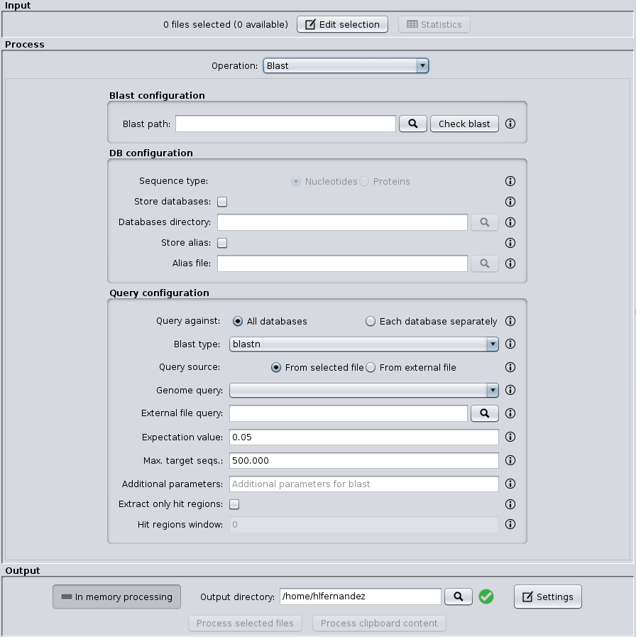

SEDA BLAST plugin
=================

This plugin allows the possibility of executing BLAST analyses trough the SEDA Graphical User Interface. In short, this plugin provides an operation that allows you to perform different BLAST queries using the selected FASTA files. Regarding the database to use in the queries, there are two possible modes: querying against all the selected FASTA files or querying against each FASTA file separately. Regarding the query, there are also to possibilities: using the sequences in one of the selected FASTA as queries or using the sequences in an external FASTA file as queries. Within this operation, one blast query is executed for each sequence in the FASTA file.



For developers
--------------

The BLAST operation can be tested with the data provided in the `test-data/blast.zip` file: the `db` and `db2` files used as input files and `query` as external query file. The `blast` CLI command can be tested as follows:
```
blast -if "/path/to"/db" -if "/path/to"/db2" -od "/tmp/blast" --query-file "/path/to"/query" --store-alias-file /tmp/alias --store-databases-directory /tmp/databases
```
