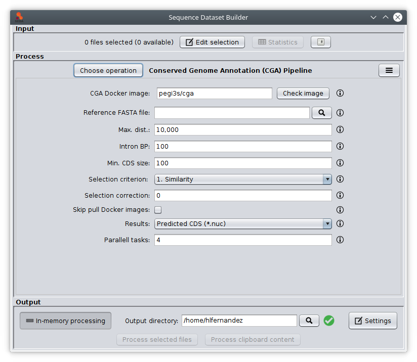

SEDA Conserved Genome Annotation (CGA) Pipeline plugin
======================================================

This plugin allows the possibility of executing the [Conserved Genome Annotation (CGA) Pipeline](https://github.com/pegi3s) trough the SEDA Graphical User Interface.



By default, the intermediate files generated by this operation in temporary directories are removed. If you need to keep them (e.g. for debugging purposes os in case of unexpected errors), it is possible to keep them by running SEDA with `-Dseda.cga.keeptemporaryfiles=true`.

For developers
--------------

The CGA pipeline involes a series of steps implemented in the `CgaPipeline` class. In order to programmatically test this pipeline, the following code can be used with the test data available [here](https://www.sing-group.org/seda/downloads/data/test-data-splign-compart.zip). It tooks about 21 minutes to complete using a workstation with Ubuntu 18.04.6 LTS, 8 CPUs (Intel(R) Core(TM) i7-8565U CPU @ 1.80GHz), 16GB of RAM and SSD disk

```java
  public static void main(String[] args) throws IOException, InterruptedException {
    System.setProperty(AbstractBinariesExecutor.SEDA_EXECUTION_SHOW_COMMANDS, "true");
    DatatypeFactory factory = DatatypeFactory.getDefaultDatatypeFactory();

    SequencesGroup input = factory.newSequencesGroup(new File("input.fasta").toPath());
    SequencesGroup reference = factory.newSequencesGroup(new File("ref.fasta").toPath());

    CgaCompiPipelineConfiguration config = new CgaCompiPipelineConfiguration(
      10000, 500, 200, SelectionCriterion.CRITERION_1, 10, false
    );

    new CgaPipeline(
      new DefaultDockerCgaBinariesExecutor(),
      new CgaPipelineParameters(new File("/tmp/seda-cga"), config, ""),
      input, reference
    ).run();
  }
```
