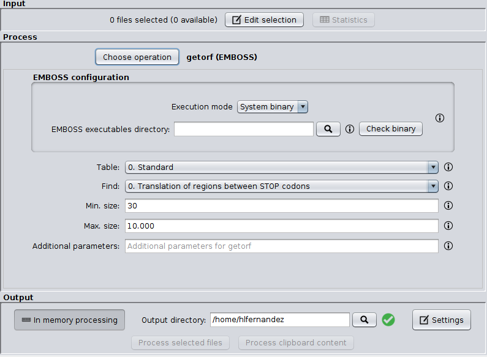

SEDA EMBOSS plugin
=============

This plugin allows the possibility of executing EMBOSS-based operations trough the SEDA Graphical User Interface. Currently, it includes the `getorf` operation to find and and extract open reading frames.

