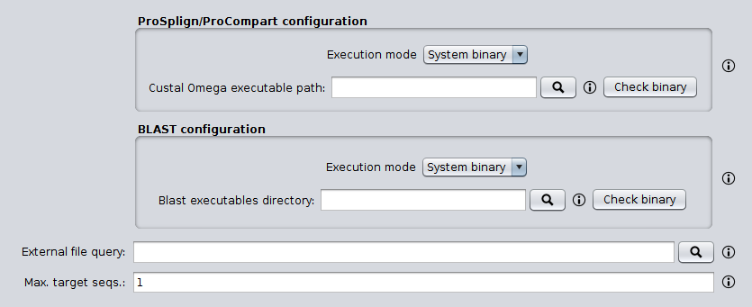

SEDA ProSplign/ProCompart plugin
================================

This plugin allows the possibility of executing the ProSplign/ProCompart trough the SEDA Graphical User Interface.



By default, the intermediate files generated by this operation in temporary directories are removed. If you need to keep them (e.g. for debugging purposes os in case of unexpected errors), it is possible to keep them by running SEDA with `-Dseda.prospligncompart.keeptemporaryfiles=true`.

For developers
----------------

The ProSplign/ProCompart pipeline involes a series of steps implemented in the `ProSplignCompartPipeline` class. In order to programmatically test this pipeline, the following code can be used with the test data available [here](https://www.sing-group.org/seda/downloads/data/test-data-prosplign-procompart.zip).

```java
public static void main(String[] args) throws IOException, InterruptedException, ExecutionException {
    ProSplignCompartBinariesExecutor proSplignCompartBinariesExecutor =
      new DockerProSplignCompartBinariesExecutor(DockerProSplignCompartBinariesExecutor.getDefaultDockerImage());
    BlastBinariesExecutor blastBinariesExecutor =
      new DockerBlastBinariesExecutor(DockerBlastBinariesExecutor.getDefaultDockerImage());
    
    File queryProteinFasta = new File("Demo_Query_Protein.fa");
    
    ProSplignCompartPipeline pipeline =
      new ProSplignCompartPipeline(proSplignCompartBinariesExecutor, blastBinariesExecutor, queryProteinFasta);
    
    File nucleotideFasta = new File("Demo_Genome_Nucleotides.fa");
    
    File outputFasta = new File("Demo_ProSplign_ProCompart_Results.fa");
    
    pipeline.proSplignCompart(nucleotideFasta, outputFasta, 1);
    
    pipeline.clearTemporaryFiles();
  }
```