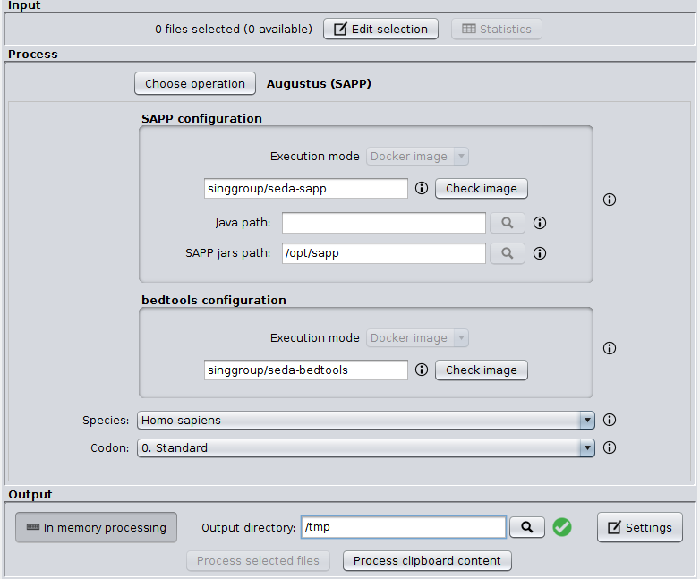

SEDA SAPP plugin
=============

This plugin allows the possibility of executing operations based in SAPP (Semantic genome Annotation Platform with Provenance) trough the SEDA Graphical User Interface. Currently, it includes an operation for gene annotation using Augustus as described in [this SAPP tutorial](https://sapp.gitlab.io/eukaryote/).



Since SAPP binaries are distributed as jar files, Java is required to run them. Algouth the `SystemBinaryExecutionConfigurationPanel` allows users to select its path, it is possible to provide it by running SEDA with `-Dseda.java.path=/path/to/java`.

For developers
----------------

The `Augustus (SAPP)` operation involes a series of steps implemented in the `SappAnnotationPipeline` class. In order to programmatically test this pipeline, the following code can be used with the test data available [here](https://www.sing-group.org/seda/downloads/data/test-data-sapp.zip).

```java
  public static void main(String[] args) throws IOException, InterruptedException {
    BedToolsBinariesExecutor bedToolsBinariesExecutor =
      new DockerBedToolsBinariesExecutor(DockerBedToolsBinariesExecutor.getDefaultDockerImage());

    SappBinariesExecutor sappBinariesExecutor = new DockerSappBinariesExecutor(new DefaultDockerSappCommands());

    SappAnnotationPipeline pipeline =
      new SappAnnotationPipeline(
        sappBinariesExecutor, bedToolsBinariesExecutor, SappCodon.STANDARD, SappSpecies.DROSOPHILA_MELANOGASTER
      );

    pipeline.annotate(
      new File("FlyBase_JCLNID.fasta"),
      new File("Augustus_Annotation.fasta")
    );
  }
```