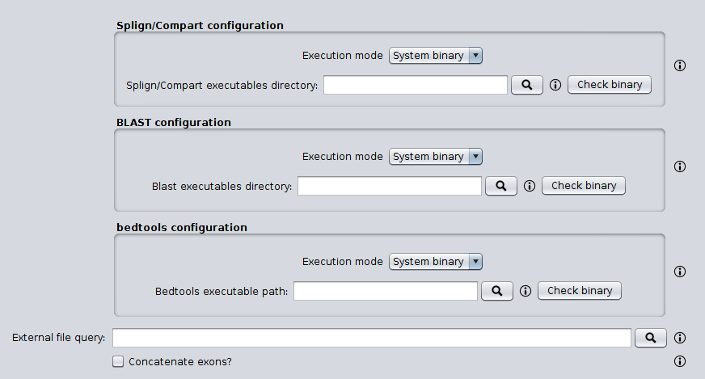

SEDA Splign/Compart plugin
=================

This plugin allows the possibility of executing the Splign/Compart pipeline trough the SEDA Graphical User Interface.



By default, the intermediate files generated by this operation in temporary directories are removed. If you need to keep them (e.g. for debugging purposes os in case of unexpected errors), it is possible to keep them by running SEDA with `-Dseda.spligncompart.keeptemporaryfiles=true`.

For developers
--------------

The Splign/Compart pipeline involes a series of steps implemented in the `SplignCompartPipeline` class. In order to programmatically test this pipeline, the following code can be used with the test data available [here](https://github.com/pegi3s/cga/raw/master/resources/test-data/cga-test-data.zip).

```java
  public static void main(String[] args) throws IOException, InterruptedException, ExecutionException {
    BedToolsBinariesExecutor bedtoolsBinariesExecutor =
      new DockerBedToolsBinariesExecutor(DockerBedToolsBinariesExecutor.getDefaultDockerImage());
    SplignCompartBinariesExecutor splignCompartBinariesExecutor =
      new DockerSplignCompartBinariesExecutor(DockerSplignCompartBinariesExecutor.getDefaultDockerImage());
    BlastBinariesExecutor blastBinariesExecutor =
      new DockerBlastBinariesExecutor(DockerBlastBinariesExecutor.getDefaultDockerImage());

    SplignCompartPipeline splignCompartPipeline =
      new SplignCompartPipeline(bedtoolsBinariesExecutor, splignCompartBinariesExecutor, blastBinariesExecutor);

    File targetFileFasta = new File("dsim-all-chromosome-r2.02.fasta");

    File cdsQueryFileFasta = new File("dmel-sod.fasta");

    File outputFasta = new File("dsim-splign-compart-result.fasta");

    splignCompartPipeline.splignCompart(targetFileFasta, cdsQueryFileFasta, outputFasta, true);
  }
```
